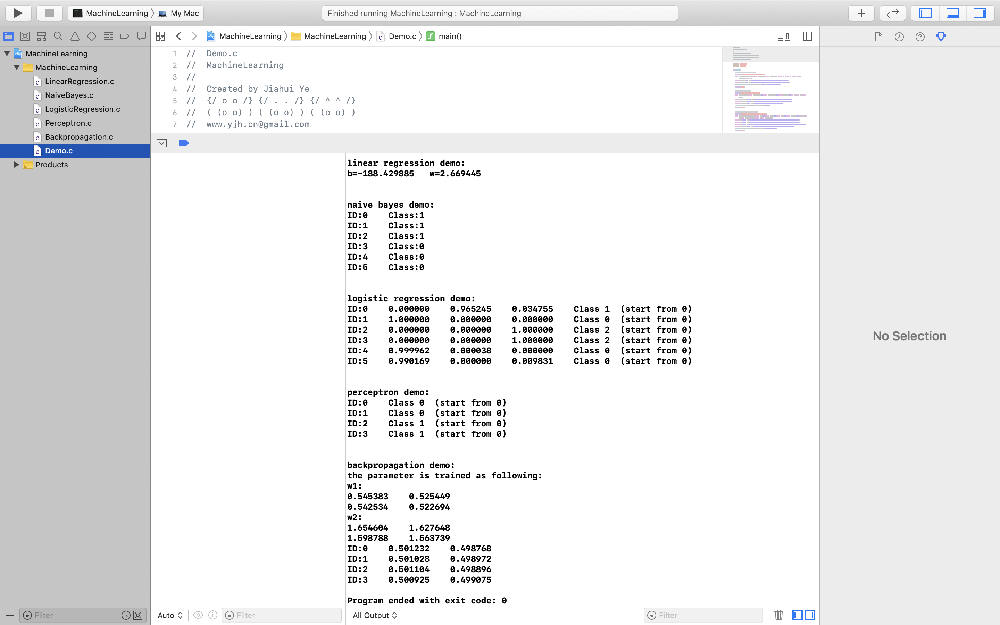

1. 文件之间存在一定的关联性，推荐作为一整个项目打开（建议使用```Xcode```，直接运行```MachineLearning.xcodeproj```即可）

2. 本项目包含**Linear Regression**、**Naive Bayes**、**Logistic Regression**、**Perceptron**、**Backpropagation**共五个算法，算法实现的部分包含在相应名字的```.c```文件中，而五个算法的测试部分统一放在```Demo.c```文件中的```main```函数中执行，最终执行结果参见下图

    

3. ```Backpropagation.c```中调用了```LogisticRegression.c```中的```sigmoid```函数，如果单个文件编译不通过请检查文件间的相关性
4. 本次作业主要是学习了国立台湾大学李宏毅的机器学习系列课程（链接：[Machine Learning (2020,Spring)](http://speech.ee.ntu.edu.tw/~tlkagk/courses_ML20.html)）相关原理之后的实践，并适当结合**machine learning algorithms from scratch**作为补充

