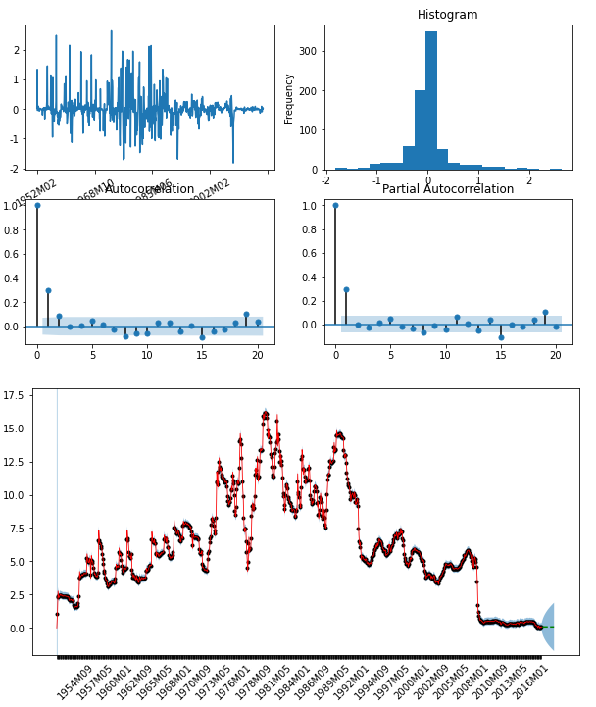
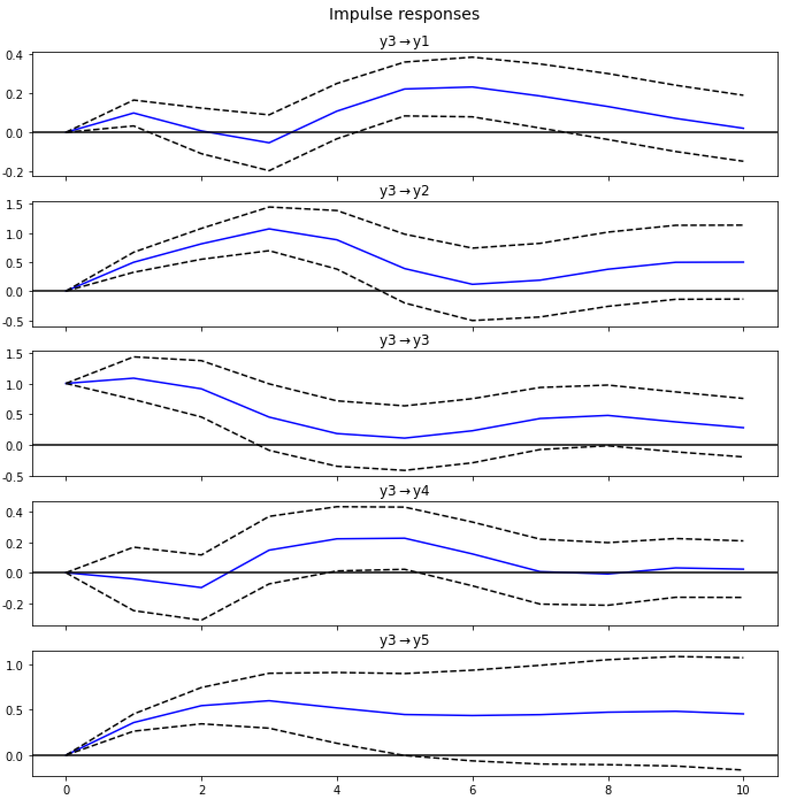

## Applied Time Series Analysis with Python

### 1 Time Series and Their Features

* The observations are typically measured at equally spaced intervals, say every minute, hour, or day, etc., so **the order in which observations arrive is paramount**. This is unlike, say, data on a cross section of a population taken at a given point in time, where the ordering of the data is usually irrelevant unless some form of spatial dependence exists between observations.

* Calculating x~T+1~, x~T+2~, .., x~T+h~ (h: forecast horizon) through x~1~, x~2~, .., x~T~ by the variety of features of time series.

#### AutoCorrelation and Periodic Movements

* These are typically referred to as the **autocorrelations** between a current value, $x_t$, and previous, or lagged, values, $x_{t-k}$, for $k=1,2,...$. The *lag-k (sample) autocorrelation* is defined as:
    $$
    r_k={{\sum^T_{t=k+1}{(x_t-\overline{x})(x_{t-k}-\overline{x})}}\over{Ts^2}}\tag{1.1}
    $$
    where
    $$
    \overline{x}=T^{-1}\sum_{t=1}^T{x_t}\tag{1.2}
    $$
    and
    $$
    s^2=T^{-1}\sum_{t=1}^T{(x_t-\overline{x})^2}\tag{1.3}
    $$
    The set of sample autocorrelations for various values of k is known as the *sample autocorrelation function* (SACF) and plays a key role in time series analysis.

#### Seasonality

* When a time series is observed at monthly or quarterly intervals an annual seasonal pattern is often an important feature, such as which is shown in right side of Fig1.1.

#### Stationarity and Nonstationarity

* A *constant mean level* is one, but not the only, condition for a series to be **stationary**.

    

* If the mean level cannot be regarded as constant then a series is said to be **nonstationary**.

    Nonstationarity, however, can appear in many guises.

    

    > Clearly, the assumption of a constant mean level for the exchange rate would not be appropriate either statistically or, indeed, economically. The exchange rate thus exhibits a form of nonstationarity that can be termed **random walk** or **unit root** nonstationarity, terms that will be defined and discussed in detail in *Chapter 4, ARIMA Models for Nonstationary Time Series*, and *Chapter 5, Unit Roots, Difference and Trend Stationarity, and Fractional Differencing*.

#### Trends

* Just as clearly, the exchange rate does not exhibit an overall **trend** throughout the observation period, this being informally thought of as a generally monotonic upward or downward movement.

* Trends are to be found in many time series. 

    

    > The figure above shows per capita wine and spirits consumption for the United Kingdom from 1950 to 2015. Both show positive trends; that for wine being stronger than that for spirits with, to a first approximation, both trends having *reasonably constant slopes*. The two series, thus, appear to exhibit **linear trends**.

* Many trends, though, do not have constant slopes and hence are **non-linear**.

  ​    

    

    > Monthly observations from 1948 to 2017 on the UK retail price index are shown above, and the index clearly has a nonconstant slope. How measures of inflation might in practice be constructed from a price index is discussed in *Chapter 2: Transforming Time Series*. Note the sequence of falling prices in the latter half of 2008 at the height of the global financial crisis which produced a brief period of deflation; a rare event in developed economies in the postwar era.

* Ascertaining whether a time series contains a trend may be quite difficult.

#### Volatility

* A second condition of stationarity is that of *constant variance*.

    A specific time series process, the GARCH process, is introduced in *Chapter 7, An Introduction to Forecasting With Univariate Models*, to model a variance that changes through time.

#### Common Features

* Two or more time series may contain common features. Such as two series both exhibit random walk nonstationarity, but appear to have a strong tendency to be “bound together” over time.

    In this case, the nonstationarity in the individual series can be “annihilated” by *taking the difference between them*. This two series thus share a common trend and are said to **cointegrate**. A potential property of nonstationary time series that will be extensively developed in *Chapter 14, Error Correction, Spurious Regressions, and Cointegration*, and *Chapter 15, VARs with Integrated Variables, VECMs, and Common Trends*.

#### Time Series Having Natural Constraints

* **Compositional time series** is one of the series with natural constraints. Because these shares must be lie between zero and one and must also add up to one for each observation, these restrictions need to be accounted for, otherwise the standard analysis of covariances and correlations would be invalid.

    Compositional time series thus require distinctive treatment through special transformations before they can be analyzed, as is done in *Chapter 16, Compositional and Count Time Series*.

* All the time series introduced so far may be regarded as being measured on a continuous scale, or at least can be assumed to be well-approximated as being continuous. Some series, however, occur naturally as (small) integers and these are often referred to as **counts**.

    These figures always use spike graphs to emphasize the integer nature of these time series and this feature requires special techniques to analyze count data successfully, and will be discussed in *Chapter 16, Compositional and Count Time Series*.

* Understanding the features exhibited by time series, both individually and in groups, is a key step in their successful analysis and clearly a great deal can be learnt by an initial plot of the data. Such plots may also suggest possible transformations of the data which may expedite formal analysis and modeling of time series, and it is to this topic that *Chapter 2, Transforming Time Series*, is devoted.

### 2 Transforming Time Series

* Prior to analyzing, statistically, an individual or a group of time series, it is often appropriate to transform the data, with an initial plot of the series often providing clues as to what transformation(s) to use.

    There are three general classes of transformations for time series which may often be combined to produce an appropriate variable to analyze:

    * dstributional
    * stationarity inducing
    * decompositional

#### Distributional Transformations

* Many statistical procedures perform more effectively on data that are *normally distributed*, or at least are *symmetric and not excessively kurtotic (fat-tailed)*, and where *the mean and variance are approximately constant*. Observed time series frequently require some form of transformation before they exhibit these distributional properties, for in their “raw” form they are often asymmetric.

    For example, if a series is only able to take positive (or at least nonnegative) values, then its distribution will usually be skewed to the right.

    In this case a simple and popular transformation is to take logarithms, usually to the base $e$.
    $$
    n\to log_e{n}
    $$

* Taking logarithms clearly reduces the extreme right-skewness found in the levels, but it certainly does not induce normality, for the distribution of the logarithms is ==distinctively bimodal==. (The left kurtotic because small data occurs more in raw data [gatherd around 0], the right because the slope of logarithmic function goes down for large n.)

    Clearly, transforming to logarithms does not induce stationarity, but taking logarithms does “straighten out” the trend, as well as stabilizes the variance. If we calculate **cumulative standard deviations**:$s_i(X)\over s_i(log_e{X})$ , where $s_i^2=i^{-1}\sum_{t=1}^i{(x_t-\overline{x_i})^2}$ and $\overline{x_i}=i^{-1}\sum_{t=1}^i{x_t}$ , we can find this ratio increases monotonically throughout the observation period.

* For attaining approximate normality, the availability of a more general class of transformations would be useful. A class of power transformations that contains the logarithmic as a special case is that proposed by Box and Cox (1964) for positive x: 
    $$
    f^{BC}(x_t,\lambda)=\left\{
    \begin{aligned}
    {x_t^\lambda-1 \over\lambda},\ \ \ \ \lambda\neq0\\
    log{x_t},\ \ \ \ \lambda=0
    \end{aligned}
    \right.
    \tag{2.1}
    $$
    The image below shows the result of **Box-Cox** transformed series for $\lambda=0.5$, essentially a square root transformation, and this series is now symmetric and, indeed, approximately normally distributed.

    

* The restriction to positive values that is required by the Box-Cox transformation can be relaxed in several ways. 

    Possible alternatives are the **signed power transformation** proposed by Bickel and Doksum (1981):
    $$
    f^{SP}(x_t,\lambda)={sgn(x_t)|x_t^\lambda|-1\over\lambda}\tag{2.2}
    $$
    or the **generalized power (GP) transformation** suggested by Yeo and Johnson (2000):
    $$
    f^{GP}(x_t,\lambda)=\left\{
    \begin{aligned}
    {(x_t+1)^\lambda-1 \over\lambda}\ \ \ \ \ \ \ \ x_t\geq0,\lambda\neq0\\
    log{(x_t+1)}\ \ \ \ \ \ \ \ x_t\geq0,\lambda=0\\
    {-((-x_t+1)^{2-\lambda}-1) \over2-\lambda}\ \ \ \ \ \ \ \ x_t<0,\lambda\neq2\\
    -log{(-x_t+1)}\ \ \ \ \ \ \ \ x_t<0,\lambda=2
    \end{aligned}
    \right.
    \tag{2.3}
    $$
    a further alternative is the **inverse hyperbolic sine (IHS) transformation** suggested by Burbidge et al. (1988) to deal with extreme values of either sign:
    $$
    f^{IHS}(x_t,\lambda)={sinh^{-1}(\lambda x_t)\over\lambda}=log{\lambda x_t+(\lambda^2x_t^2+1)^{1\over2}\over\lambda}\ \ \ \ \ \ \ \ \lambda>0\tag{2.4}
    $$

* The transformation parameter $\lambda$ may be estimated by the method of maximum likelihood (ML).

    Suppose that for a general transformation $f(x_t,\lambda)$ , the model $f(x_t,\lambda)=\mu_t+a_t$ is assumed, where $\mu
    _t$ is a model for the mean of $f(x_t,\lambda)$ and $a_t～N(0,c)$ . The ML estimator $\hat \lambda$ is obtained by maximizing the log-likelihood function:
    $$
    l(\lambda)=C_f-({T\over2})\sum_{t=1}^T{log\hat a_t^2+D_f(x_t,\lambda)}\tag{2.5}
    $$
    where $\hat a_t=f(x_t,\lambda)-\hat \mu_t$ are the residuals from ML estimation of the model, $C_f$ is a constant and $D_f(x_t,\lambda)$ depends on which of the transformations is being used:
    $$
    D_f(x_t,\lambda)=\left\{
    \begin{aligned}
    (\lambda-1)\sum_{t=1}^T{log|x_t|},\ \ \ \ for(2.1)and(2.2)\\
    (\lambda-1)\sum_{t=1}^T{sgn(x_t)log(|x_t|+1)},\ \ \ \ \ \ \ \ for(2.3)\\
    -{1\over2}\sum_{t=1}^T{log(1+\lambda^2x_t^2)},\ \ \ \ \ \ \ \ for(2.4)
    \end{aligned}
    \right.
    $$
    then a confidence interval for $\lambda$ can be constructed using the standard result that $2(l(\hat\lambda)-l(\lambda))$ is asymptotically distributed as $\chi^2(1)$ , so that a 95% confidence interval, is given by those values of $\lambda$ for which $l(\hat\lambda)-l(\lambda)<1.92$ .

    The image below shows the examples using GP and IHS transformations.

    

```{python}
# 以2009年1月至2020年7月的北京市的月降水量数据为例进行分析(数据来源：后知气象 http://hz.zc12369.com/home/)
import pandas as pd
import numpy as np
import math
import matplotlib.pyplot as plt

# read_data
data = pd.read_excel("./Beijing.xls",index_col=0)

# Box and Cox: for positive x
def BC_transform(arr, parameter):
    arr = np.array(arr)
    for ele in arr:
        if ele <= 0:
            print("BC_transform函数要求序列元素大于0")
            return
    if parameter == 0:
        arr = math.log(arr)
    else:
        arr = (arr ** parameter - 1) / parameter
    return arr

# generalized power (GP) transformation
def GP_transform(arr, parameter):
    arr = np.array(arr)
    for i in range(0, len(arr)):
        ele = arr[i]
        if ele < 0 and parameter == 2:
            arr[i] = -math.log(1 - ele)
        if ele < 0 and parameter != 2:
            arr[i] = -(((1 - ele) ** (2 - parameter) - 1)/(2 - parameter))
        if ele >= 0 and parameter == 0:
            arr[i] = math.log(1 + ele)
        if ele >= 0 and parameter != 0:
            arr[i] = ((1 + ele) ** parameter - 1) / parameter
    return arr

# inverse hyperbolic sine (IHS) transformation
def IHS_transform(arr, parameter):
    arr = np.array(arr)
    if parameter > 0:
        pass
    else:
        print("IHS_transform函数要求序列元素大于0")
        return
    for i in range(0, len(arr)):
        ele = arr[i]
        arr[i] = math.log((ele * parameter + (ele**2 * parameter**2 + 1) ** 0.5) / parameter)
    return arr

IHS_data = IHS_transform(data["rainfall"], 0.2)
GP_data = GP_transform(data["rainfall"], 0.2)
x_values = data.index

# plot
plt.plot(x_values, IHS_data, label="IHS")
plt.plot(x_values, GP_data, label="GP")
plt.plot(data, label="origin")
plt.legend(loc=0, ncol=1)
plt.show()
```

Output:


#### Stationarity Inducing Transformations

* A simple stationarity transformation is to take successive differences of a series, on defining the **first-difference** of $x_t$ as $\nabla x_t=x_t-x_{t-1}$ . The trends in series may be eradicated by this transformation. More recommend both practically and theoretically for transforming a nonstationary series to stationarity will be shown in *Chapter 4, ARIMA Models for Nonstationary Time Series*.

    First-differencing may, on some occasions, be insufficient to induce stationarity and further differencing may be required. In the following example, although first differencing (shown as the middle panel) mitigates these switches in trend and changes in level, it by no means eliminates them; second-differences are required to achieve this, as shown in the bottom panel.

    

* The **second-differences** shown above are defined as **the first-difference of the first-difference**, that is, $\nabla\nabla x_t=\nabla^2x_t$ . To provide an explicit expression for second-differences, it is convenient to introduce the **lag operator B**, defined such that $B^jx_t\equiv x_{t-j}$ , so that:
    $$
    \nabla x_t=x_t-x_{t-1}=x_t-Bx_t=(1-B)x_t \tag{2.6}
    $$
    Consequently:
    $$
    \nabla^2 x_t=(1-B)^2x_t=(1-2B+B^2)x_t=x_t-2x_{t-1}+x_{t-2} \tag{2.7}
    $$
    which is clearly *not* the same as $x_t-x_{t-2}=\nabla_2x_t$ , the **two-period difference**, where the notation $\nabla_j=1-B^j$ for the taking of j-period differences has been introduced.

    The difference between two is shown below:

    

* For some time series (such as financial time series), interpretation can be made easier by taking proportional or percentage changes rather than simple differences, that is, transforming by $\nabla x_t\over x_{t-1}$ or $100{\nabla x_t\over x_{t-1}}$

* When transforming to an annual rate in the monthly series, such a transformation does *not* necessarily induce stationarity.

* There is a useful relationship between the rate of change of a variable and its logarithm that is often worth bearing in mind, namely: (Because $log(1+n)\approx n $ for small n)
    $$
    {x_t-x_{t-1}\over x_{t-1}}={x_t\over x_{t-1}}-1\approx log{x_t\over x_{t-1}}=logx_t-logx_{t-1}=\nabla logx_t\tag{2.8}
    $$

```{python}
import pandas as pd
import matplotlib.pyplot as plt
from pandas.plotting import register_matplotlib_converters
register_matplotlib_converters()

# read_data
data = pd.read_excel("./Beijing.xls", index_col=0)

def diff_func(data, n):
    D_data = data.diff().dropna()
    if n == 1:
        return D_data
    else:
        for i in range(1, n):
            D_data = D_data.diff().dropna()
        return D_data

D1_data = diff_func(data["rainfall"], 1)
D2_data = diff_func(data["rainfall"], 2)
plt.plot(D1_data, label="diff1")
plt.plot(D2_data, label="diff2")
plt.plot(data, label="origin")
plt.legend()
plt.show()
```

Output:


#### Decomposing a Time Series and Smoothing Transformations

```{python}
import numpy as np
import matplotlib.pyplot as plt

# 移动平均
def moving_average(interval, window_size):
    window = np.ones(int(window_size)) / float(window_size)
    return np.convolve(interval, window, 'same')

# example
x_values = np.linspace(start=-4, stop=4, num=100)
y = np.sin(x_values) + np.random.randn(len(x_values)) * 0.1
y_av = moving_average(interval=y, window_size=10)
plt.plot(x_values, y_av, "r.-", label="smooth")
plt.plot(x_values, y, "g.-", label="original")
plt.legend()
plt.show()
```

Output:


### 3 ARMA Models for Stationary Time Series

#### An ARMA Process for the NAO

```{python}
import pandas as pd
import matplotlib.pyplot as plt
from ARMA import judge_series, determinate_order, ARMA_model, tsplot
import warnings

warnings.filterwarnings("ignore")

# read_data
data = pd.read_excel("dataset/nao.xlsx", index_col=0)
judge_series(data["nao"])

# plot
tsplot(data["nao"])
plt.show()

# determinate order
order = determinate_order(data["nao"], maxlag=5)

# model
ARMA_model = ARMA_model(data["nao"], order)

# predict
predict = ARMA_model.predict(start=0, end=830)
plt.plot(predict, 'g', label="predict")
plt.plot(data["nao"], 'r--', label="origin")
plt.legend(loc=0, ncol=1)
plt.show()
```

Output:


#### Modeling the United Kingdom Interest Rate Spread

```{python}
import pandas as pd
import matplotlib.pyplot as plt
from ARMA import judge_series, determinate_order, ARMA_model, tsplot
import warnings

warnings.filterwarnings("ignore")

# read_data
data = pd.read_excel("dataset/interest_rates.xlsx", index_col=0)
judge_series(data["spread"])

# plot
tsplot(data["spread"])
plt.show()

# determinate order
order = determinate_order(data["spread"], maxlag=5)

# model
ARMA_model = ARMA_model(data["spread"], order)

# predict
predict = ARMA_model.predict(start=0, end=830)
plt.plot(predict, 'g', label="predict")
plt.plot(data["spread"], 'r--', label="origin")
plt.legend(loc=0, ncol=1)
plt.show()
```

Output:


#### Modeling the Sunspot Number

```{python}
import pandas as pd
import matplotlib.pyplot as plt
from ARMA import determinate_order, ARMA_model, tsplot
import warnings

warnings.filterwarnings("ignore")

# read_data
data = pd.read_excel("dataset/sunspots.xlsx", index_col=0)

# plot
tsplot(data["sunspot"])
plt.show()

# determinate order
order = determinate_order(data["sunspot"], maxlag=5)

# model
ARMA_model = ARMA_model(data["sunspot"], order)

# predict
predict = ARMA_model.predict(start=0, end=350)
predict.index = predict.index + 1700
plt.plot(predict, 'g', label="predict")
plt.plot(data, 'r--', label="origin")
plt.legend(loc=0, ncol=1)
plt.show()
```

Output:


#### 核心代码(ARMA.py)

```{python}
import pandas as pd
import sys
import matplotlib.pyplot as plt
import statsmodels.api as sm
import statsmodels.tsa.api as smt
from statsmodels.tsa.stattools import adfuller as adf
from statsmodels.tsa.stattools import arma_order_select_ic
from statsmodels.stats.diagnostic import acorr_ljungbox
from statsmodels.tsa.arima_model import ARMA
from statsmodels.graphics.api import qqplot
import numpy as np

def judge_series(data):
    # ADF检验
    dftest = adf(data)
    dfoutput = pd.Series(dftest[0:4], index=['Test Statistic','p-value','#Lags Used','Number of Observations Used'])
    stationarity = 1
    random = 1
    for key, value in dftest[4].items():
        dfoutput['Critical Value (%s)'%key] = value
        if dftest[0] > value:
                stationarity = 0
    print("是否平稳(1/0): %d" % (stationarity))
    # 纯随机性检验（白噪声检验）
    if stationarity == 1:
        p_value = acorr_ljungbox(data, lags=1)
        if p_value[1][0] < 0.05:      # 拒绝原假设
            random = 0
        print("是否具有纯随机性(1/0):", 0 if random == 0 else 1)
    return stationarity, random

def tsplot(y, lags=20, title='', figsize=(15, 8)):
    fig = plt.figure(figsize=figsize)

    ts_ax = fig.add_subplot(2, 2, 1)
    y.plot(ax=ts_ax)
    plt.xticks(rotation=30)
    ts_ax.set_title(title)

    hist_ax = fig.add_subplot(2, 2, 2)
    y.plot(ax=hist_ax, kind='hist', bins=20)
    hist_ax.set_title('Histogram')

    acf_ax = fig.add_subplot(2, 2, 3)
    smt.graphics.plot_acf(y, lags=lags, ax=acf_ax)

    pacf_ax = fig.add_subplot(2, 2, 4)
    smt.graphics.plot_pacf(y, lags=lags, ax=pacf_ax)

def determinate_order(timeseries,maxlag):
    best_p = 0
    best_q = 0
    best_bic = sys.maxsize
    for p in np.arange(maxlag):
        for q in np.arange(maxlag):
            model = ARMA(timeseries, order=(p, q))
            try:
                results_ARMA = model.fit(disp=-1)
            except:
                continue
            bic = results_ARMA.bic
            if bic < best_bic:
                best_p = p
                best_q = q
                best_bic = bic
        # print('第{}次完成...'.format(p + 1))
    return best_p, best_q

def ARMA_model(train, order):
    arma_model = ARMA(train, order).fit(disp=-1)  # 激活模型
    plt.plot(arma_model.predict(), 'k', label="ARMA")
    plt.plot(train, 'r--', label="origin")
    plt.legend(loc=0, ncol=1)
    plt.show()
    print(arma_model.summary())
    print('RMSE: %.4f' % np.sqrt(sum((arma_model.predict() - train) ** 2) / train.size))

    # 模型检验
    resid = arma_model.resid    # 残差
    # 利用QQ图检验残差是否满足正态分布
    plt.figure(figsize=(12, 8))
    qqplot(resid, line='q', fit=True)
    plt.show()
    # 利用D-W检验,检验残差的自相关性
    print('D-W检验值为{}'.format(sm.stats.durbin_watson(resid.values)))  # 接近2：无相关性
    return arma_model
```

### 4 ARIMA Models for Nonstationary Time Series

#### Modeling the U.K. Spread as an Integrated Process

```python
import pandas as pd
from ARIMA import ARMA_model, tsplot, diff_func, reduction
import matplotlib.pyplot as plt

# read_data
data = pd.read_csv("dataset/interest_rates.csv", index_col=0)

# difference
D_data, first_values = diff_func(data["rate"], 1)
tsplot(D_data, lags=10)

# ARIMA(1, 1, 0)
time_series_restored1 = ARMA_model(D_data, (1, 0))

# reduction
reduction1 = reduction(time_series_restored1, first_values)
# plot
plt.plot(reduction1, label="ARIMA")
plt.plot(data, label="origin")
plt.legend()
plt.show()

# ARIMA(0, 1, 1)
time_series_restored2 = ARMA_model(D_data, (0, 1))

# reduction
reduction2 = reduction(time_series_restored2, first_values)
# plot
plt.plot(reduction2, label="ARIMA")
plt.plot(data, label="origin")
plt.legend()
plt.show()
```

Output:


#### Modeling the Exchange Rate

```python
import pandas as pd
from ARIMA import ARMA_model, tsplot, diff_func, reduction
import matplotlib.pyplot as plt

# read_data
data = pd.read_excel("dataset/dollar.xlsx", index_col=0)

# difference
D_data, first_values = diff_func(data["dollar"], 1)
tsplot(D_data, lags=10)

# ARIMA(0, 1, 1)
p = 0
q = 1
time_series_restored = ARMA_model(D_data, (p, q))

# reduction
reduction = reduction(time_series_restored, first_values)
# plot
plt.plot(reduction, label="ARIMA")
plt.plot(data, label="origin")
plt.legend()
plt.show()
```

Output:


#### Modeling Global Temperatures

```python
import pandas as pd
from ARIMA import ARMA_model, tsplot, diff_func, reduction
import matplotlib.pyplot as plt

# read_data
data = pd.read_excel("dataset/global_temps.xlsx", index_col=0)

# difference
D_data, first_values = diff_func(data["temp"], 1)
tsplot(D_data, lags=10)

# ARIMA(0, 1, 3)
p = 0
q = 3
time_series_restored = ARMA_model(D_data, (p, q))

# reduction
reduction = reduction(time_series_restored, first_values)
# plot
plt.plot(reduction, label="ARIMA")
plt.plot(data, label="origin")
plt.legend()
plt.show()
```

Output:


#### 核心代码(ARIMA.py)

```{python}
import pandas as pd
import sys
import matplotlib.pyplot as plt
import statsmodels.api as sm
import statsmodels.tsa.api as smt
from statsmodels.tsa.stattools import adfuller as adf
from statsmodels.stats.diagnostic import acorr_ljungbox
from statsmodels.tsa.arima_model import ARMA
from statsmodels.graphics.tsaplots import plot_acf, plot_pacf
from statsmodels.graphics.api import qqplot
import warnings
import numpy as np

warnings.filterwarnings("ignore")
plt.rcParams["font.sans-serif"] = ["SimHei"]   # 用来正常显示中文标签
plt.rcParams["axes.unicode_minus"] = False     # 用来正常显示负号

# 数据检测
def judge_series(data):
    # ADF检验
    dftest = adf(data)
    dfoutput = pd.Series(dftest[0:4], index=['Test Statistic','p-value','#Lags Used','Number of Observations Used'])
    stationarity = 1
    random = 1
    for key, value in dftest[4].items():
        dfoutput['Critical Value (%s)'%key] = value
        if dftest[0] > value:
                stationarity = 0
    print("是否平稳(1/0): %d" % (stationarity))
    # 纯随机性检验（白噪声检验）
    if stationarity == 1:
        p_value = acorr_ljungbox(data, lags=1)
        if p_value[1][0] < 0.05:      # 拒绝原假设
            random = 0
        print("是否具有纯随机性(1/0):", 0 if random == 0 else 1)
    return stationarity, random

# 已知差分阶数
def diff_func(data, n):
    first_values = []
    first_values.append(data.head(1))
    D_data = data.diff().dropna()
    if n == 1:
        return D_data, first_values
    else:
        for i in range(2, n+1):
            D_data = D_data.diff().dropna()
            if i < n:
                first_values.append(D_data.head(1))
        return D_data, first_values

# 未知差分阶数
def choose_d(data):
    first_values = []
    first_values.append(data.head(1))
    D_data = data.diff().dropna()
    if judge_series(D_data) == (1, 0):
        return D_data, 1, first_values
    else:
        first_values.append(D_data.head(1))
        d = 1
        flag = True
        while flag:           # 继续差分的标志
            D_data = D_data.diff().dropna()
            result = judge_series(D_data)
            if result != (1, 0):
                first_values.append(D_data.head(1))
                d += 1
            else:
                flag = False
        return D_data, d+1, first_values

def tsplot(y, lags=20, title='', figsize=(15, 8)):
    fig = plt.figure(figsize=figsize)

    ts_ax = fig.add_subplot(2, 2, 1)
    y.plot(ax=ts_ax)
    plt.xticks(rotation=30)
    ts_ax.set_title(title)

    hist_ax = fig.add_subplot(2, 2, 2)
    y.plot(ax=hist_ax, kind='hist', bins=20)
    hist_ax.set_title('Histogram')

    acf_ax = fig.add_subplot(2, 2, 3)
    smt.graphics.plot_acf(y, lags=lags, ax=acf_ax)

    pacf_ax = fig.add_subplot(2, 2, 4)
    smt.graphics.plot_pacf(y, lags=lags, ax=pacf_ax)
    plt.show()

def determinate_order(timeseries, maxlag):
    # ACF和PACF图
    plot_acf(timeseries, lags=14)  # 延迟数
    plot_pacf(timeseries, lags=14)
    plt.show()
    # 定阶
    best_p = 0
    best_q = 0
    best_bic = sys.maxsize
    for p in np.arange(maxlag):
        for q in np.arange(maxlag):
            model = ARMA(timeseries, order=(p, q))
            try:
                results_ARMA = model.fit(disp=-1)
            except:
                continue
            bic = results_ARMA.bic
            if bic < best_bic:
                best_p = p
                best_q = q
                best_bic = bic
    return best_p, best_q

def ARMA_model(train, order):
    arma_model = ARMA(train, order).fit(disp=-1)  # 激活模型
    pre = arma_model.predict()
    plt.plot(train,'r--', label="origin")
    plt.plot(pre, label="ARIMA")
    plt.legend(loc=0, ncol=1)
    print(arma_model.summary())

    # 残差
    resid = arma_model.resid
    # 利用QQ图检验残差是否满足正态分布
    plt.figure(figsize=(12, 8))
    qqplot(resid, line='q', fit=True)
    plt.show()
    # 利用D-W检验,检验残差的自相关性
    print('D-W检验值为{}'.format(sm.stats.durbin_watson(resid.values)))  # 接近2：无相关性
    return pre

# 差分后还原
def reduction(predict, first_values):
    for first in reversed(first_values):
        predict = first.append(predict, ignore_index=False).cumsum()
    return predict
```

### 5 Unit Roots, Difference and Trend Stationarity, and Fractional Differencing

#### Unit Root Test on the Spread and the $-￡ Exange Rate

The fitted AR(2) model:
$$
x_t = \underset{(0.029)}{0.056}+\underset{(0.034)}{1.2979x_{t-1}}-\underset{(0.034)}{0.3064x_{t-2}}+\hat a_t
$$

```{python}
import pandas as pd
import matplotlib.pyplot as plt
from statsmodels.tsa.stattools import adfuller

# 读取数据
spread = pd.read_csv('./interest_rates.csv',header=1,index_col=0)
dollar = pd.read_excel('./dollar.xlsx',index_col=0)
#print(data.index)
date = pd.date_range('1952-03',periods=784,freq='M')
spread.index = date

print("Spread: statistic : ",adfuller(spread)[0],"   critical values:",adfuller(spread)[4])
print("Exchange: statistic : ",adfuller(dollar)[0],"   critical values:",adfuller(dollar)[4])
```

Output:


####  Is There a Unit Root in Global Temperatures?

```{python}
import pandas as pd
import matplotlib.pyplot as plt
from statsmodels.tsa.stattools import adfuller

# 读取数据
data = pd.read_excel('./global_temps.xlsx',index_col=0)
#print(data.index)
date = pd.date_range('1850-02',periods=2015,freq='M')
data.index = date
data.plot()
print("tau statistic : ",adfuller(data)[0],"   critical values:",adfuller(data)[4])
#I(1) process
```

Output:


#### Trends in Wine and Spirit Consumption

To distinguish the series between DS and TS, we estimate the trend-included ADF regression

```{python}
import pandas as pd
import matplotlib.pyplot as plt
from statsmodels.tsa.stattools import adfuller

# 读取数据
data = pd.read_excel('./wine_spirits.xlsx',index_col=0,header=None)
data.plot()

# we include the trend to excetu the ADF test
print("tau statistic : ",adfuller(data,regression='ct')[0],"   critical values:",adfuller(data,regression='ct')[4])
```

Output:


$\tau_{\tau}$ statistic is -2.97, which is insignificant as the 10% critical value is -3.17. So the series is confirmed as a DS, rather than TS process.

#### Are Shocks to British GDP Temporary or Permanent?

```{python}
import pandas as pd
import matplotlib.pyplot as plt
from statsmodels.tsa.stattools import adfuller
import numpy as np

# 读取数据
data = pd.read_excel('./gdp.xlsx',index_col=0,header=None).loc[1822:1913].apply(np.log)
data.plot()

#AR process
print("\nAR process\n")
print("tau statistic : ",adfuller(data)[0],"\np-value: ",adfuller(data)[1],\
      "\ncritical values:",adfuller(data)[4])
#TS
print("TS process\n")
print("tau statistic : ",adfuller(data,regression='ct')[0],"\np-value: ",adfuller(data,regression='ct')[1],\
      "\ncritical values:",adfuller(data,regression='ct')[4])
```

Output:


The $\tau_{\tau}$ statistic of TS = -3.98 has a p-value of just 0.013, a TS representation is clearly appropriate.

#### Is Box and Jenkins' Series C I(2)?

```{python}
import pandas as pd
import matplotlib.pyplot as plt
from statsmodels.tsa.stattools import adfuller
from statsmodels.tsa.arima_model import ARMA
import numpy as np
from statsmodels.graphics.tsaplots import plot_acf, plot_pacf

# 读取数据
data = pd.read_excel('./bj_series_c.xlsx',index_col=0,header=None)
data.plot(title='Original Data')
plt.show()

# 绘制各阶差分的ACF图像并在各阶差分下进行ADF分析
plot_acf(data,lags=12,title='Origin ACF')
plt.show()

print("\nNo-Difference\n")
print("tau statistic : ",adfuller(data)[0],"\np-value: ",adfuller(data)[1],\
      "\ncritical values:",adfuller(data)[4])

data = data.diff(1).dropna()
plot_acf(data,lags=12,title='First-difference ACF')
plt.show()

print("\nFirst-Difference\n")
print("tau statistic : ",adfuller(data)[0],"\np-value: ",adfuller(data)[1],\
      "\ncritical values:",adfuller(data)[4])

data = data.diff(1).dropna()
plot_acf(data,lags=12,title='Second-difference ACF')
plt.show()

print("\nSecond-Difference\n")
print("tau statistic : ",adfuller(data)[0],"\np-value: ",adfuller(data)[1],\
      "\ncritical values:",adfuller(data)[4])

# ARIMA(1,1,0) process
data = pd.read_excel('./data/bj_series_c.xlsx',index_col=0,header=None)
model = ARMA(data.diff().dropna(),(1,0)).fit()
print(model.summary())
```

Output:


####  Estimating the Trend in Central England Temperatures Robustly

Establishing the trend of CET is clearly of great interest for debates concerning global warming. By computing unit root and stationarity tests, for $DF-GLS = -9.212$ and $\eta_{\tau}=0.189$, the former rejecting the unit root null at the 1% level, the latter rejecting the TS null at the 5% level! This is clearly a situation when estimating the trend robustly is called for.

```{python}
import math
import numpy as np
import pandas as pd
import matplotlib.pyplot as plt
from statsmodels.tsa.stattools import adfuller,kpss
from statsmodels.tsa.arima_model import ARMA
from statsmodels.graphics.tsaplots import plot_acf, plot_pacf
from sklearn.linear_model import LinearRegression


# 读取数据
data = pd.read_excel('./cet.xlsx',index_col=0,header=None)
data.plot(title='CET')
plt.show()

# calculate the standard unit root test statistic
print(adfuller(data,regression='ct'))
U = adfuller(data,regression='ct')[0]

# calculate the standard trend-stationarity test statistic
print(kpss(data,regression='ct'))
S = kpss(data,regression='ct')[0]

# calculate the lambda
kappa = 0.00025
lamb = math.exp(-kappa*U*U/S/S)
print("lambda: ",lamb)

# calculate z_lambda
z0=3.689;z1=0.615;beta1_hat=0.002749;beta1_wave=0.004777;s0=0.000745;s1=0.007769
c_alpha = 1.96
z_l = (1-lamb)*z0+lamb*z1
beta1_l = ((1-lamb)*beta1_hat*s1+lamb*beta1_wave*s0)/((1-lamb)*s1+lamb*s0)
delta = c_alpha*s0*s1/((1-lamb)*s1+lamb*s0)
print("Temperature changes about ",beta1_l-delta,'±',beta1_l+delta,'℃')
```

Output:


### 6 Breaking and Nonlinear Trends

#### ADF Tests of Breaking Trend Processes

```{python}
import pandas as pd
from statsmodels.tsa import stattools

data=pd.read_excel('gdp.xlsx',index_col=0)

def ADF_test(df,name):
    df['diff']=df[name].copy()
    
    for i in range(100):
        results=stattools.adfuller(data['diff'][i:])
        if(results[0]<results[4]['1%']):
            print("the series are I(",str(i),")!:)")
            df['diff'].plot()
            break
        else:
            print("the series are not I(",str(i),")!:(")
        df['diff']=df['diff'].diff(1)
        
    return i

ADF_test(data,'gdp')
```

Output:


#### LSTR and Fourier Models for GDP Process

```{python}
import math
import numpy as np
import pandas as pd
import matplotlib.pyplot as plt
import statsmodels.formula.api as sm

data=pd.read_excel('gdp.xlsx',use_col=[1])

def S_t(t,gamma,m,T=50):
    return pow((1+math.exp(-gamma*(t-m*T))),-1)

def estim(y,param):
    n=len(y)
    T=n/2
    gamma,m=param[0],param[1]
    
    data['t']=np.zeros(n)
    data['st']=np.zeros(n)
    for t in range(n):
        data.loc[t,('t')]=t
        data.loc[t,('st')]=S_t(t,gamma,m,T)
    
    results = sm.ols(formula='gdp ~ t + st + t*st', data = data).fit()
    data['residual'] = data['gdp']-data['t']*results.params[1]-data['st']*results.params[2]\
                    -data['t']*data['st']*results.params[3]-results.params[0]
    return results

y=data['gdp']
results=estim(data['gdp'],[0.0085,1.907])
print(results.summary())

fore=np.zeros(len(y))
fore=results.params[0]+results.params[1]*data['t']+results.params[2]*data['st']\
    +results.params[3]*data['t']*data['st']

plt.plot(fore)
plt.plot(data['gdp']
```

Output:


#### LSTR Versus a Unit Root in United Kingdom Interest Rates

```{python}
import math
import numpy as np
import pandas as pd
import matplotlib.pyplot as plt
from statsmodels.tsa import stattools
import statsmodels.formula.api as sm

data=pd.read_excel('interest_rates.xlsx',index_col=0)

def ADF_test(df,name):
    df[name+'diff']=df[name].copy()
    
    for i in range(100):
        results=stattools.adfuller(data[name+'diff'][i:])
        if(results[0]<results[4]['1%']):
            print("the series " + name + " are I(",str(i),")!:)")
            df[name+'diff'].plot()
            break
        else:
            print("the series " + name + " are not I(",str(i),")!:(")
        df[name+'diff']=df[name+'diff'].diff(1)
        
    return results

def S_t(t,gamma,m,T=50):
    return pow((1+math.exp(-gamma*(t-m*T))),-1)

def estim(data,y,param):
    n=len(data)
    T=n/2
    gamma,m=param[0],param[1]
    
    data['t']=np.zeros(n)
    data['st']=np.zeros(n)
    
    for t in range(n):
        data['t'][t]=t
        data['st'][t]=S_t(t,gamma,m,T)
    
    if(y=='rs'):
        results = sm.ols(formula='rs ~ t + st + t*st', data = data).fit()
        data['residual_rs'] = data['rs']-data['t']*results.params[1]-data['st']*results.params[2]\
                    -data['t']*data['st']*results.params[3]-results.params[0]
                    
    elif(y=='r20'):
        results = sm.ols(formula='r20 ~ t + st + t*st', data = data).fit()
        data['residual_r20'] = data['rs']-data['t']*results.params[1]-data['st']*results.params[2]\
                    -data['t']*data['st']*results.params[3]-results.params[0]
    
    return results

def forecast(results_params):
    
    fore=np.zeros(len(data))
    fore=results_params[0]+results_params[1]*data['t']+results_params[2]*data['st']\
        +results_params[3]*data['t']*data['st']
    
    return fore

### RS ###
results=estim(data,'rs',[0.0125,0.507])
print(results.summary())
fore=forecast(results.params)

plt.figure(figsize=(8,8))
plt.subplot(2,1,1)
ADF_test(data,'rs')

plt.subplot(2,1,2)
plt.plot(fore)
plt.plot(data['rs'])
plt.title("Estimate of RS")

### R20 ###
results=estim(data,'r20',[0.018,0.655])
print(results.summary())
fore=forecast(results.params)

plt.figure(figsize=(8,8))
plt.subplot(2,1,1)
ADF_test(data,'r20')

plt.subplot(2,1,2)
plt.plot(fore)
plt.plot(data['r20'])
plt.title("Estimate of R20")
```

Output:


#### Determining a Fourier approximation for GDP Process

```{python}
import numpy as np
import pandas as pd
import matplotlib.pyplot as plt
import statsmodels.formula.api as sm

data=pd.read_excel('gdp.xlsx',index_col=0)

w=0.001
data['x']=np.arange(len(data))
x=data['x'].values
data['cwx']=np.cos(w*x)
data['c2wx']=np.cos(2*w*x)
data['c3wx']=np.cos(3*w*x)
data['swx']=np.sin(w*x)
data['s2wx']=np.sin(2*w*x)
data['s3wx']=np.sin(3*w*x)

results=sm.ols(formula='gdp ~ cwx + c2wx + c3wx + swx + s2wx + s3wx', data = data).fit()
print(results.summary())

fore=np.zeros(len(data))
fore=results.params[0]+results.params[1]*data['cwx']+results.params[2]*data['c2wx']\
    +results.params[3]*data['c3wx']+results.params[4]*data['swx']\
    +results.params[5]*data['s2wx']+results.params[6]*data['s3wx']

plt.plot(data['gdp'])
plt.plot(fore)
plt.legend(['observed','forecast'])
```

Output:


### 7 An Introduction to Forecasting With Univariate Models

#### ARIMA Forecasting of the Spread

```{python}
import numpy as np
import pandas as pd
import matplotlib.pyplot as plt
import statsmodels.api as sm
import statsmodels.tsa.api as smt

data=pd.read_excel('interest_rates.xlsx',index_col=0)
print(data)
data['diff1']=data['RS'].diff(1)
data = data.dropna()

def tsplot(y,lags=20,title='',figsize=(15,8)):
    
    fig=plt.figure(figsize=figsize)
    
    ts_ax=fig.add_subplot(2,2,1)
    y.plot(ax=ts_ax)
    plt.xticks(rotation=30)
    ts_ax.set_title(title)
    
    hist_ax=fig.add_subplot(2,2,2)
    y.plot(ax=hist_ax,kind='hist',bins=20)
    hist_ax.set_title('Histogram')
    
    acf_ax=fig.add_subplot(2,2,3)
    smt.graphics.plot_acf(y,lags=lags,ax=acf_ax)
    
    pacf_ax=fig.add_subplot(2,2,4)
    smt.graphics.plot_pacf(y,lags=lags,ax=pacf_ax)

tsplot(data['diff1'],20)

d=1
p=2
q=3

mod = sm.tsa.arima.ARIMA(data['RS'], order=(p,d,q))
res = mod.fit()
print(res.summary())

# forecast
nforecast = 20
predict = res.get_prediction(end=mod.nobs + nforecast)
idx = np.arange(len(predict.predicted_mean))
predict_ci = predict.conf_int(alpha=0.5)
# Graph prepare
fig, ax = plt.subplots(figsize=(15,6))
ax.plot(data['RS'], 'k.')

# Plot
ax.plot(idx[:-nforecast], predict.predicted_mean[:-nforecast], 'r', linewidth=0.8)
ax.plot(idx[-nforecast:], predict.predicted_mean[-nforecast:], 'g--')
ax.fill_between(idx[:], predict_ci.iloc[:, 0], predict_ci.iloc[:, 1], alpha=.5)
plt.ylim(-2,18)
plt.xticks(rotation=45)
for i in range(4):
    for label in ax.get_xticklabels()[::2]:
        label.set_visible(False)
```

Output:




#### Forecasting Global Temperatures

```{python}
import numpy as np
import pandas as pd
import matplotlib.pyplot as plt
import statsmodels.api as sm
import statsmodels.tsa.api as smt

# Dataset
data = pd.read_excel('global_temps.xlsx',index_col=0)

# compute the anomaly
for i in range(12):
    data.iloc[i::12,0]-=np.nanmean(data.iloc[i::12,0])
# delete NaNs
data = data.dropna()

print(data)

data['diff1']=data['temp'].diff(1)
data = data.dropna()

data['diff2']=data['diff1'].diff(1)
data = data.dropna()

def tsplot(y,lags=20,title='',figsize=(15,8)):
    
    fig=plt.figure(figsize=figsize)
    
    ts_ax=fig.add_subplot(2,2,1)
    y.plot(ax=ts_ax)
    ts_ax.set_title(title)
    plt.xticks(rotation=30)
    
    hist_ax=fig.add_subplot(2,2,2)
    y.plot(ax=hist_ax,kind='hist',bins=20)
    hist_ax.set_title('Histogram')
    
    acf_ax=fig.add_subplot(2,2,3)
    smt.graphics.plot_acf(y,lags=lags,ax=acf_ax)
    plt.xlim(-1,lags)
    
    pacf_ax=fig.add_subplot(2,2,4)
    smt.graphics.plot_pacf(y,lags=lags,ax=pacf_ax)
    plt.xlim(-1,lags)

tsplot(data['diff1'],20)

d=1
p=12
q=2
mod = sm.tsa.arima.ARIMA(data['temp'], order=(p,d,q))
res = mod.fit()
print(res.summary())

# forecast
nforecast = 200
predict = res.get_prediction(end=mod.nobs + nforecast)
idx = np.arange(len(predict.predicted_mean))
predict_ci = predict.conf_int(alpha=0.5)
# Graph prepare
fig, ax = plt.subplots(figsize=(15,6))
ax.plot(data['temp'], 'k.')

# Plot
ax.plot(idx[:-nforecast], predict.predicted_mean[:-nforecast], 'gray', linewidth=0.8)
ax.plot(idx[-nforecast:], predict.predicted_mean[-nforecast:], 'g--')
ax.fill_between(idx[:], predict_ci.iloc[:, 0], predict_ci.iloc[:, 1], alpha=0.3)
plt.ylim(-1.2,1.2)
plt.xticks(rotation=45)
for i in range(6):
    for label in ax.get_xticklabels()[::2]:
        label.set_visible(False)
```

Output:


#### Forecasting the All Share Index as a TS Process

```{python}
import numpy as np
import pandas as pd
import matplotlib.pyplot as plt
import statsmodels.api as sm
import statsmodels.tsa.api as smt

data = sm.datasets.macrodata.load_pandas().data
index = pd.Index(sm.tsa.datetools.dates_from_range('1959Q1', '2009Q3'))
data.index = index
del data['year']
del data['quarter']
data['realgdp']=np.log(data['realgdp'])


# illustrate
fig = plt.figure(figsize=(12,8))

ax1 = fig.add_subplot(2,1,1)
data.realgdp.plot(ax=ax1,fontsize=16)
legend=ax1.legend(loc = 'upper left')
legend.prop.set_size(20)
gdp_cycle, gdp_trend = sm.tsa.filters.hpfilter(data.realgdp)
gdp_decomp = data[['realgdp']].copy()
gdp_decomp["cycle"] = gdp_cycle
gdp_decomp["trend"] = gdp_trend

ax2 = fig.add_subplot(2,1,2)
gdp_decomp[["realgdp", "trend"]]["2000-03-31":].plot(ax=ax2, fontsize=16)
legend = ax2.get_legend()
legend.prop.set_size(20)


data = data.dropna()
data['diff1']=data['realgdp'].diff(1)
data = data.dropna()

data['diff2']=data['diff1'].diff(1)
data = data.dropna()

def tsplot(y,lags=20,title='',figsize=(15,8)):
    
    fig=plt.figure(figsize=figsize)
    
    ts_ax=fig.add_subplot(2,2,1)
    y.plot(ax=ts_ax)
    ts_ax.set_title(title)
    plt.xticks(rotation=30)
    
    hist_ax=fig.add_subplot(2,2,2)
    y.plot(ax=hist_ax,kind='hist',bins=20)
    hist_ax.set_title('Histogram')
    
    acf_ax=fig.add_subplot(2,2,3)
    smt.graphics.plot_acf(y,lags=lags,ax=acf_ax)
    plt.xlim(-1,lags)
    
    pacf_ax=fig.add_subplot(2,2,4)
    smt.graphics.plot_pacf(y,lags=lags,ax=pacf_ax)
    plt.xlim(-1,lags)


def forecast(data,colname,order,nforecast,ylim):
    mod = sm.tsa.arima.ARIMA(data[colname], order=order)
    res = mod.fit()
    print(res.summary())
    
    # forecast
    predict = res.get_prediction(end=mod.nobs + nforecast)
    predict_ci = predict.conf_int(alpha=.5)

    # Graph prepare
    fig, ax = plt.subplots(figsize=(15,6))
    ax.plot(data[colname], 'r.',alpha=.2)
    
    # Plot
    ax.plot(predict_ci.index[:-nforecast], predict.predicted_mean[:-nforecast], 'gray', linewidth=.8)
    ax.plot(predict_ci.index[-nforecast:], predict.predicted_mean[-nforecast:], 'g--')
    ax.fill_between(predict_ci.index[:], predict_ci.iloc[:, 0], predict_ci.iloc[:, 1], alpha=.5)
    plt.xticks(rotation=45)
    plt.ylim(ylim[0],ylim[1])


tsplot(data['diff1'],lags=20,title='Real GDP')

d=1
p=3
q=3

forecast(data,'realgdp',(p,d,q),20,[7.75,9.75])
```

Output:


### 8 Unobserved Component Models, Signal Extraction, and Filters

#### Beveridge-Nelson Deomposition of the All Share Index

```{python}
import pandas as pd
import matplotlib.pyplot as plt
from statsmodels.tsa.filters.hp_filter import hpfilter

# 读取数据
data = pd.read_excel('./data/global_temps.xlsx',index_col=0,header=None)
data.index = pd.date_range('1850-01',periods=2016,freq='M')

cycle,trend = hpfilter(data,14400)
plt.plot(trend,label='14400',lw=1)
cycle,trend = hpfilter(data,129600)
plt.plot(trend,label='129600',ls=':',lw=1)
cycle,trend = hpfilter(data,500000)
plt.plot(trend,label='500000',ls='--',lw=2)
plt.legend()
```

Output:


#### Fitting an H-P Trend to British Real Per Capita GDP

```{python}
import pandas as pd
import matplotlib.pyplot as plt
from statsmodels.tsa.filters.hp_filter import hpfilter

# 读取数据
data = pd.read_excel('./data/gdp.xlsx',index_col=0,header=None)
print(data.index)

cycle,trend = hpfilter(data,10000)
plt.plot(trend,label='trend')
plt.plot(data,ls='--',lw=1,label='origin data')
plt.legend()
```

Output:


### 9 Seasonality and Exponential Smoothing

#### A Deterministic Seasonal Model for Rainfall  

A  "seasonal mean" model  is like:
$$
x_t=\sum_{i=1}^m \alpha_i s_{i,t}+ u_t \tag{9.1}
$$
where $u \sim N(0,\sigma^2)$ and $s_{i,t}$ is a dummy variable.

``` python
import numpy as np
import pandas as pd
import matplotlib.pyplot as plt
from statsmodels.formula.api import ols

# 读取数据
data = pd.read_excel('dataset/rainfall.xlsx', index_col=None)
rainfall = pd.DataFrame(np.sqrt(data["rainfall"]))

# 分离出月份列
date = data["date"].str.split('M', expand=True)
month = date[1]
month = pd.cut(month.astype(str).astype(int),12,labels=range(1,13))
data[1] = month

# 将月份转换为哑变量
month = pd.get_dummies(data[1], prefix="month")
data = month.join(rainfall)
print(data)

# OLS拟合
model = ols('rainfall ~ month_1+month_2+month_3+month_4+month_5+month_6'
         '+month_7+month_8+month_9+month_10+month_11+month_12 -1', data=data).fit(fit_intercept=False)
print(model.summary())

# 月降水量估计值
rainfall_estimate = round(model.params ** 2 * 10)
print(rainfall_estimate)
```

Output:


#### Seasonal ARIMA Modeling of Beer Sales 

A  "Seasonal ARIMA" model's form  is:
$$
ARIMA(p，d，q)×(P，D，Q)s \tag{9.1}
$$

```{python}
from Seasonality import judge_series, optimal_parameter, SARIMA_model, tsplot
import pandas as pd
import matplotlib.pyplot as plt
from statsmodels.tsa.seasonal import seasonal_decompose

# 读取数据
data = pd.read_excel('dataset/beer.xlsx', index_col=0)
data.plot()

# 数据分解
decomposition = seasonal_decompose(data["销量"], freq=12)
decomposition.plot()

# 消除趋势项, 确定d
D_data = data.diff().dropna()
D_data.columns = [u"一阶差分"]

# 季节差分, 确定D
D_data = D_data.diff(12).dropna()
D_data.columns = [u"一阶差分&12步差分"]

# 检验是否平稳
judge_series(D_data[u"一阶差分&12步差分"])
tsplot(D_data[u"一阶差分&12步差分"])


order = (0,1,0,1)
SARIMA_model(data["销量"],(order[0],1,order[1]),(order[2],1,order[3],4))
```

Output:


##### 核心代码(Seasonality.py)

``` python
import pandas as pd
import numpy as np
import warnings
import itertools
import statsmodels.tsa.api as smt
import matplotlib.pyplot as plt
from statsmodels.tsa.stattools import adfuller as adf
from statsmodels.graphics.api import qqplot
from statsmodels.stats.diagnostic import acorr_ljungbox
import statsmodels.api as sm

warnings.filterwarnings("ignore")

# 数据检测
def judge_series(data):
    # ADF检验
    dftest = adf(data)
    dfoutput = pd.Series(dftest[0:4], index=['Test Statistic','p-value','#Lags Used','Number of Observations Used'])
    stationarity = 1
    random = 1
    for key, value in dftest[4].items():
        dfoutput['Critical Value (%s)'%key] = value
        if dftest[0] > value:
                stationarity = 0
    print("是否平稳(1/0): %d" % (stationarity))
    # 纯随机性检验（白噪声检验）
    if stationarity == 1:
        p_value = acorr_ljungbox(data, lags=1)
        if p_value[1][0] < 0.05:      # 拒绝原假设
            random = 0
        print("是否具有纯随机性(1/0):", 0 if random == 0 else 1)
    return stationarity, random


def tsplot(y, lags=20, title='', figsize=(15, 8)):
    fig = plt.figure(figsize=figsize)

    ts_ax = fig.add_subplot(2, 2, 1)
    y.plot(ax=ts_ax)
    plt.xticks(rotation=30)
    ts_ax.set_title(title)

    hist_ax = fig.add_subplot(2, 2, 2)
    y.plot(ax=hist_ax, kind='hist', bins=20)
    hist_ax.set_title('Histogram')

    acf_ax = fig.add_subplot(2, 2, 3)
    smt.graphics.plot_acf(y, lags=lags, ax=acf_ax)

    pacf_ax = fig.add_subplot(2, 2, 4)
    smt.graphics.plot_pacf(y, lags=lags, ax=pacf_ax)


def optimal_parameter(d, D, m, data):
    Qs = range(0, 3)
    qs = range(0, 3)
    Ps = range(0, 3)
    ps = range(0, 3)
    # 遍历所有组合
    parameters = itertools.product(ps, qs, Ps, Qs)
    parameters_list = list(parameters)
    # list参数列表
    print('parameters_list:{}'.format(parameters_list))
    print(len(parameters_list))

    best_aic = float("inf")
    best_param = ()
    for parameters in parameters_list:
        try:
            model = sm.tsa.statespace.SARIMAX(data, order=(parameters[0], d, parameters[1]),
                                              seasonal_order=(parameters[2], D, parameters[3], m)).fit(disp=-1)
        except ValueError:
            print('wrong parameters:', parameters)
            continue

        aic = model.aic
        if aic < best_aic:
            best_aic = aic
            best_param = parameters
    return best_param


def SARIMA_model(train, order, seasonal_order):
    show = pd.DataFrame()
    show['origin'] = train
    sarima_model = sm.tsa.statespace.SARIMAX(train, trend='n', order=order,
                                             seasonal_order=seasonal_order).fit(disp=-1) 
    print(sarima_model.summary())
    show['pred'] = sarima_model.predict()
    show[['origin', 'pred']].plot(figsize=(12, 8))
    print('RMSE: %.4f' % np.sqrt(sum((show['pred'] - show['origin']) ** 2) / show['origin'].size))

    # 模型检验
    resid = sarima_model.resid    # 残差
    # 利用QQ图检验残差是否满足正态分布
    plt.figure(figsize=(12, 8))
    qqplot(resid, line='q', fit=True)
    plt.show()
    # 利用D-W检验,检验残差的自相关性
    print('D-W检验值为{}'.format(sm.stats.durbin_watson(resid.values)))  # 接近2：无相关性
```

#### Global Temperatures Using Exponential Smoothing

``` python
import pandas as pd
import matplotlib.pyplot as plt
from statsmodels.tsa.holtwinters import ExponentialSmoothing
import warnings

warnings.filterwarnings("ignore")
data = pd.read_excel('dataset/global_temps.xlsx', index_col=0)

model = ExponentialSmoothing(data, seasonal='additive', seasonal_periods=12).fit()
pred = model.predict(start=data.index[0], end=data.index[-1])

# plot
plt.plot(data, 'r--', label="origin")
plt.plot(pred, 'b', label="predict")
plt.legend()
plt.show()
```

Output:


#### Holt-Winters Seasonal Modeling of Beer Sales

```{python}
from exponential_smoothing import holtWinters
import numpy as np
import pandas as pd
import matplotlib.pyplot as plt

data = pd.read_excel('dataset/beer.xlsx', index_col=0)

data = np.array(data["销量"])
results = holtWinters(data, 12, 3, 12, mtype='additive')
print("三个平滑参数为：", results['alpha'], results['beta'], results['gamma'])

# plot
x_values = np.array(range(1, len(results['smoothed'])+1))
plt.plot(x_values, np.array(results['smoothed']), label="smoothed")
plt.plot(np.array(range(1, len(data)+1)), np.array(data)+1, label="origin")
plt.legend()
plt.show()
```

Output:


##### 核心代码(exponential_smoothing.py)

```python
import math
import warnings
import numpy as np
import pandas as pd
import matplotlib.pyplot as plt
from sklearn import linear_model
from scipy.optimize import fmin_l_bfgs_b

warnings.filterwarnings("ignore")
plt.rcParams["font.sans-serif"] = ["SimHei"]   # 用来正常显示中文标签
plt.rcParams["axes.unicode_minus"] = False     # 用来正常显示负号

# Holt-Winters三次指数平滑
def holtWinters(data, p, sp, ahead, mtype, alpha=None, beta=None, gamma=None):
    a, b, s = init_Values(mtype, data, p, sp)

    if alpha == None or beta == None or gamma == None:
        tuning = [0.1, 0.1, 0.1]
        bounds = [(0, 1), (0, 1), (0, 1)]   # 限定取值范围
        optimized = fmin_l_bfgs_b(_MSD, tuning, args=(mtype, data, p, a, b, s[:]), bounds=bounds, approx_grad=True)
        alpha, beta, gamma = optimized[0]

    MSD, params, smoothed = exp_Smooth(mtype, data, p, a, b, s[:], alpha, beta, gamma)
    predicted = predict_Values(mtype, p, ahead, params)

    return {'alpha': alpha, 'beta': beta, 'gamma': gamma, 'MSD': MSD, 'params': params, 'smoothed': smoothed,
            'predicted': predicted}

# 确定初始值
def init_Values(mtype, data, p, sp):
    initSeries = pd.Series(data[:p * sp])

    if mtype == 'additive':
        rawSeason = initSeries - initSeries.rolling(p).mean()
        initSeason = [np.nanmean(rawSeason[i::p]) for i in range(p)]
        initSeason = pd.Series(initSeason) - np.mean(initSeason)
        deSeasoned = [initSeries[i] - initSeason[i % p] for i in range(len(initSeries))]
    else:
        rawSeason = initSeries / initSeries.rolling(p).mean()
        initSeason = [np.nanmean(rawSeason[i::p]) for i in range(p)]
        initSeason = pd.Series(initSeason) / math.pow(np.prod(np.array(initSeason)), 1 / p)
        deSeasoned = [initSeries[j] / initSeason[j % p] for j in range(len(initSeries))]

    lm = linear_model.LinearRegression()
    lm.fit(pd.DataFrame({'time': [t + 1 for t in range(len(initSeries))]}), pd.Series(deSeasoned))
    return float(lm.intercept_), float(lm.coef_), list(initSeason)

def _MSD(tuning, *args):
    predicted = []
    mtype = args[0]
    data, p = args[1:3]
    Lt1, Tt1 = args[3:5]
    St1 = args[5][:]
    alpha, beta, gamma = tuning[:]

    for t in range(len(data)):
        if mtype == 'additive':
            Lt = alpha * (data[t] - St1[t % p]) + (1 - alpha) * (Lt1 + Tt1)
            Tt = beta * (Lt - Lt1) + (1 - beta) * (Tt1)
            St = gamma * (data[t] - Lt) + (1 - gamma) * (St1[t % p])
            predicted.append(Lt1 + Tt1 + St1[t % p])
        else:
            Lt = alpha * (data[t] / St1[t % p]) + (1 - alpha) * (Lt1 + Tt1)
            Tt = beta * (Lt - Lt1) + (1 - beta) * (Tt1)
            St = gamma * (data[t] / Lt) + (1 - gamma) * (St1[t % p])
            predicted.append((Lt1 + Tt1) * St1[t % p])

        Lt1, Tt1, St1[t % p] = Lt, Tt, St

    return sum([(data[t] - predicted[t]) ** 2 for t in range(len(predicted))]) / len(predicted)

def exp_Smooth(mtype, data, p, a, b, s, alpha, beta, gamma):
    smoothed = []
    Lt1, Tt1, St1 = a, b, s[:]

    for t in range(len(data)):
        if mtype == 'additive':
            Lt = alpha * (data[t] - St1[t % p]) + (1 - alpha) * (Lt1 + Tt1)
            Tt = beta * (Lt - Lt1) + (1 - beta) * (Tt1)
            St = gamma * (data[t] - Lt) + (1 - gamma) * (St1[t % p])
            smoothed.append(Lt1 + Tt1 + St1[t % p])
        else:
            Lt = alpha * (data[t] / St1[t % p]) + (1 - alpha) * (Lt1 + Tt1)
            Tt = beta * (Lt - Lt1) + (1 - beta) * (Tt1)
            St = gamma * (data[t] / Lt) + (1 - gamma) * (St1[t % p])
            smoothed.append((Lt1 + Tt1) * St1[t % p])

        Lt1, Tt1, St1[t % p] = Lt, Tt, St

    MSD = sum([(data[t] - smoothed[t]) ** 2 for t in range(len(smoothed))]) / len(smoothed)
    return MSD, (Lt1, Tt1, St1), smoothed

def predict_Values(mtype, p, ahead, params):
    Lt, Tt, St = params
    if mtype == 'additive':        # 加法模型
        return [Lt + (t + 1) * Tt + St[t % p] for t in range(ahead)]
    else:                          # 乘法模型
        return [(Lt + (t + 1) * Tt) * St[t % p] for t in range(ahead)]
```

### 10 Volatility and Generalized Autoregressive Conditional Heteroskedastic Processes

#### AR-GARCH model

``` python
import pandas as pd
import warnings
import arch
import matplotlib.pyplot as plt

warnings.filterwarnings("ignore")
plt.rcParams["font.sans-serif"] = ["SimHei"]
plt.rcParams["axes.unicode_minus"] = False

# read_data
data = pd.read_excel('dollar.xlsx', index_col=0)
data["diff1"] = data.diff().dropna()
data["diff1"].plot(label="diff1")
data["dollar"].plot(label="origin")
plt.legend(loc=0, ncol=1)
plt.show()

# AR(1)-GARCH(1, 1)
model = arch.univariate.arch_model(data["dollar"], mean="AR", lags=1)    # mean:AR(1)
res = model.fit(update_freq=0)
print(res.summary())

res.conditional_volatility.plot(figsize=(12, 5), color='r')
plt.title("条件方差")
plt.show()

# forecast_plot
forecasts = res.forecast(horizon=1, start=1, method='simulation')
plt.plot(forecasts.mean.iloc[:, 0], 'r', label="AR-GARCH")
plt.plot(data["dollar"], 'b:', label="origin")
plt.legend(loc=0, ncol=1)
plt.show()
```

Output:


### 11 Nonlinear Stochastic Process

#### A SETAR Model for Sunspots

```python
import math
import numpy as np
import pandas as pd
import matplotlib.pyplot as plt
import statsmodels.api as sm
from statsmodels.tsa.stattools import adfuller,kpss
from statsmodels.tsa.arima_model import ARMA
from statsmodels.graphics.tsaplots import plot_acf, plot_pacf
from sklearn.linear_model import LinearRegression

# 读取数据
data = pd.read_excel('./data/sunspots.xlsx',index_col=0,header=None)
data = data.iloc[150:,:]
#data.plot(title='sunspots')

# 将序列依次滞后，并合并
def lag_mat(series,lag):
    mer = []
    for i in range(lag,0,-1):
        mer.append(series.drop(series.index[0:i-1]).reset_index(drop=True))
    #return pd.concat(mer,axis=1).dropna()
    #只需要t-1,t-2,t-9
    return pd.concat([mer[0],mer[1],mer[-1]],axis=1).dropna()

# SETAR拟合函数
## regimes=3
def setar_model(y,p,d,c1,c2):
    X = lag_mat(y,p)
    y = y.iloc[p:].dropna().reset_index(drop=True)
    #设置列名以便之后进行筛选
    y.columns=['y']
    X = sm.add_constant(X)
    source = pd.concat([y,X],axis=1).dropna().reset_index(drop=True)
    sou1 = source[ source['y'] < c1 ]
    sou2 = source[ source['y'] >= c1]
    sou2 = sou2[ sou2['y']<=c2 ]
    sou3 = source[ source['y'] > c2 ]
    
    res1 = sm.OLS(sou1['y'], sou1.drop('y',axis=1)).fit()
    res2 = sm.OLS(sou2['y'], sou2.drop('y',axis=1)).fit()
    res3 = sm.OLS(sou3['y'], sou3.drop('y',axis=1)).fit()
    
    print("regime1: <",c1,'\n',res1.summary())
    print("regime1: <",c1,'\n',res2.summary())
    print("regime1: <",c1,'\n',res3.summary())

def forecast(material,num,para1,para2,para3,c1,c2):
    idx = material.size
    p = para1.size
    pre = material[0:p]
    for i in range(num):
        if material[(p+i)-2]<c1:
            new = np.dot(np.array([1,material[(p+i)-1],material[(p+i)-2],material[(p+i)-9]]),para1)
        if material[(p+i)-2]>=c1 and material[-2]>=c1:
            new = np.dot(np.array([1,material[(p+i)-1],material[(p+i)-2],material[(p+i)-9]]),para2)
        if material[(p+i)-2]>c2:
            new = np.dot(np.array([1,material[(p+i)-1],material[(p+i)-2],material[(p+i)-9]]),para3)
        pre = np.append(pre,new)
        
    return pre

setar_model(data,9,2,20.2,94)
para1 = np.array([5.5651,0.0326,0.1271,0.0043])
para2 = np.array([14.3958,0.7832,-0.2654,0.1871])
para3 = np.array([42.7777,0.7426,-0.2812,0.3139])
pre = forecast(np.array(data),150,para1,para2,para3,20.2,94)
plt.figure()
plt.plot(pre,label='predict')
plt.plot(np.array(data),label='data')
plt.legend()
```

Output:


#### An ESTAR Model for Long Interest Rates

```python
import math
import numpy as np
import pandas as pd
import matplotlib.pyplot as plt
import statsmodels.api as sm
from statsmodels.tsa.stattools import adfuller,kpss
from statsmodels.tsa.arima_model import ARMA
from statsmodels.graphics.tsaplots import plot_acf, plot_pacf
from sklearn.linear_model import LinearRegression
from scipy.optimize import leastsq,minimize

# 读取数据
data = pd.read_excel('./data/interest_rates.xlsx',index_col=0)['r20'][-300:]
diff = data.diff().dropna()
plt.figure(figsize=(16,8))
diff.plot(title='UK yield on 20-year gilts')
plt.show()

# 将序列依次滞后，并合并
# 最后一列是x(t-d),其余列是x(t-p)
def lag_mat(series,lag,d):
    mer = []
    for i in range(max(lag,d),0,-1):
        mer.append(series.drop(series.index[0:i-1]).reset_index(drop=True))
    # append x(t-d)
    if lag>=d:
        mer = pd.concat(mer+[mer[d-1]],axis=1,ignore_index=True)
    else:
        mer = pd.concat(mer[0:lag-1]+[mer[-1]],axis=1,ignore_index=True)
    mer.columns = np.arange(0,min(lag,d)+1)
    return mer.dropna()

def trans_fun(x,gamma,c):
    for i in range(x.size):
        x[i] = math.exp(-gamma*(x[i]-c)*(x[i]-c))
    return x

# par 是ESTAR模型中的个位置参数，一共有2p+2个
def resid(par,x,y,p):
    # 先对x(t-d)施加transition function G_E
    x[:,-1] = trans_fun(x[:,-1],par[-1],par[-2])
    y_hat = np.zeros(x[:,-1].size)
    for i in range(p):
        y_hat += par[i]*x[:,i]+par[i+p]*x[:,-1]*x[:,i]
    return ((np.array(y)-y_hat)**2).sum()
    
## series is a DataFrame
## p d are integers, and others are float
def ESTAR_model(series,p,d):
    X = lag_mat(series,p,d)
    X = X.drop(X.index[-1])
    Y = series.drop(series.index[0:max(d,p)])
    Y.index = X.index
    #print(X)
    #print(Y)
    par = np.random.randn(2*p+2)
    #resid(par,y,X,p)
    res = minimize(resid,par,args=(np.array(X),np.array(Y),p),method='SLSQP')
    return res.x
    
def forecast(data,paras,d):
    pre = data[:paras.size]
    p = int(paras.size/2-1)
    for i in range(paras.size-1,data.size):
        temp = 0
        for j in range(p):
            temp += paras[j]*data[i-j]+paras[j+p]*math.exp(-paras[-1]*(data[i-d]-paras[-2])*(data[i-d]-paras[-2]))*data[i-j]
        if i>=paras.size:
            pre = np.append(pre,temp)
        else:
            pre[i] = temp
    return (pre + np.random.normal(size=pre.size)/10)

paras = ESTAR_model(data,2,2)
print(paras)
pre = forecast(np.array(data),paras,2)
plt.figure(figsize=(16,8))
plt.plot(pre,label='predict',color='k',ls='--')
plt.plot(np.array(data),label='data')
plt.legend()
```

Output:


#### A Markov-Switching Model for the dollar-pounds Exchange Rate

```python
import math
import numpy as np
import pandas as pd
import matplotlib.pyplot as plt
import statsmodels.api as sm
from statsmodels.tsa.stattools import adfuller,kpss
from statsmodels.tsa.arima_model import ARMA
from statsmodels.graphics.tsaplots import plot_acf, plot_pacf
from sklearn.linear_model import LinearRegression
from scipy.optimize import leastsq,minimize


# read data
data = pd.read_excel('./data/dollar.xlsx',index_col=0)[-900:]
diff = data.diff().dropna()
plt.figure(figsize=(16,8))
plt.plot(data)
plt.title('dollar-pounds exchange rate')
plt.show()

# fit model
model = sm.tsa.MarkovRegression(data, k_regimes=2)
res = model.fit()
res.summary()
```

Output:


#### Nonlinearity Tests for Long Interest Rate

```python
import numpy as np
import pandas as pd
import matplotlib.pyplot as plt
from statsmodels.tsa.stattools import bds


# read data
data = pd.read_excel('./data/interest_rates.xlsx',index_col=0)['r20']
plt.figure(figsize=(16,8))
plt.plot(data)
plt.title('Long Interest Rate')
plt.show()

# BDS test
bds_statis = bds(data)
print('bds test : ',bds_statis)
```

Output:


### 12 Transfer Functions and Autoregressive Distributed Lag Modeling

The ARDL model is like:
$$
y_t=c+\sum_{i=1}^m \alpha_i y_{t-i}+\sum_{j=0}^n \beta_j x_{t-j} + u_t \tag{12.1}
$$
where $u \sim N(0,\sigma^2)$

#### ARDL Modeling of Global Temperatures

The model is established as following:
$$
\nabla TEMP_t=\beta_0+\sum_{i=1}^m \phi_i\nabla TEMP_{t-i}+\sum_{i=0}^m\beta_{1,i}\nabla TRF_{t-i}+\sum_{i=0}^m\beta_{2,i}VOLC_{t-i}\\+\sum_{i=0}^m\beta_{3,i}SOI_{t-i}+\sum_{i=0}^m\beta_{4,i}AMO_{t-i}+\alpha_t \tag{12.2}
$$
ARDL(4,0,1,1,1)

```{python}
import numpy as np
import pandas as pd
import matplotlib.pyplot as plt
from statsmodels.formula.api import ols

data=pd.read_csv("climate.csv",index_col=0)

def ARDL_fit(data,order,param):
    beta0=param[0]
    sigma=param[-1]
    alpha=np.sqrt(sigma)*np.random.randn(len(data))
    phi=[]
    for par in param[1:-1]:
        phi.append(par)
    
    fore=np.zeros(len(data))
    fore[:max(order)]=data.iloc[:max(order),0]
    
    for t in range(max(order),len(data)):
        fore[t]=beta0
        for j in range(len(order)):
            for i in range(order[j]+1):
                fore[t]+=phi[j][i]*data.iloc[t-i,j]
        fore[t]+=alpha[t]
    
    data['forecast']=fore
    plt.plot(data.iloc[:,0],'k',label='observation')
    plt.plot(data['forecast'],'r--',label='forecasting')
    plt.legend()
    return fore

# set order as example
order=(4,0,1,1,1)

# compute the lag data
data['temp_1']=np.zeros(len(data))
data['temp_1'][1:]=data['temp'][:-1]
data['temp_2']=np.zeros(len(data))
data['temp_2'][2:]=data['temp'][:-2]
data['temp_3']=np.zeros(len(data))
data['temp_3'][3:]=data['temp'][:-3]
data['temp_4']=np.zeros(len(data))
data['temp_4'][4:]=data['temp'][:-4]
data['volc_1']=np.zeros(len(data))
data['volc_1'][1:]=data['volc'][:-1]
data['soi_1']=np.zeros(len(data))
data['soi_1'][1:]=data['soi'][:-1]
data['amo_1']=np.zeros(len(data))
data['amo_1'][1:]=data['amo'][:-1]

# fit the model by OLS
lr = ols('temp ~ temp_1+temp_2+temp_3+temp_4+trf+volc+volc_1+soi+soi_1+amo+amo_1',data=data).fit()
print(lr.summary())

ARDL_fit(data,order,[-.2409,[0,.2769,.0334,.0163,.098],[.2511],[.0316,.051],[-.0271,-.0093],[.4116,-.1646],0.009])
```

Output:


### 13 Vector Autoregressions and Granger Causality

#### Variance Decomposition and Innovation Accounting for the Bond and Gilt Markets

```{python}
import pandas as pd
import warnings
from statsmodels.tsa.api import VAR
import matplotlib.pyplot as plt
import statsmodels.api as sm

warnings.filterwarnings("ignore")
plt.rcParams["font.sans-serif"] = ["SimHei"]   # 用来正常显示中文标签
plt.rcParams["axes.unicode_minus"] = False     # 用来正常显示负号

# 读取数据
data = pd.read_excel('interest_rates.xlsx', index_col=0)

# 差分
D_data = pd.DataFrame()
D_data["drs"] = data["rs"].diff()
D_data["dr20"] = data["r20"].diff()
D_data.index = data.index
D_data.drop(D_data.index[0], inplace=True)  # 去除首行
D_data.plot()
plt.show()

# 协整检验
result = sm.tsa.stattools.coint(D_data["drs"], D_data["dr20"])
print(result)

order = 2

# 模型
model = VAR(D_data)
results = model.fit(order)
print(results.summary())
results.plot()
plt.show()

# 脉冲响应分析
irf = results.irf(10)
irf.plot(orth=False, impulse='drs')
irf.plot(orth=False, impulse='dr20')

# 累计脉冲响应
irf.plot_cum_effects(orth=False)
plt.show()

# 方差分解
fevd = results.fevd(5)
fevd.summary()
results.fevd(20).plot()
plt.show()
```

Output:


#### Quenouille’s Hog Series Example Revisited

```{python}
import pandas as pd
import numpy as np
import warnings
from statsmodels.tsa.api import VAR, SVAR
import matplotlib.pyplot as plt

warnings.filterwarnings("ignore")
plt.rcParams["font.sans-serif"] = ["SimHei"]   # 用来正常显示中文标签
plt.rcParams["axes.unicode_minus"] = False     # 用来正常显示负号

# 读取数据
data = pd.read_excel('quenouille.xlsx', index_col=0)
# data.plot()
# plt.show()

# VAR模型
model = VAR(data)
results = model.fit(4)
print(results.summary())

# 残差自相关图
results.plot_acorr(6)
plt.show()

# 脉冲响应分析
irf = results.irf(10)
irf.plot(orth=False, impulse='y1')
irf.plot(orth=False, impulse='y2')
irf.plot(orth=False, impulse='y3')
irf.plot(orth=False, impulse='y4')
irf.plot(orth=False, impulse='y5')
plt.show()

# 累计脉冲响应
irf.plot_cum_effects(orth=False)
plt.show()

# 方差分解
fevd = results.fevd(5)
fevd.summary()
results.fevd(20).plot()
plt.show()

# SVAR模型
model = SVAR(data, svar_type="A",                      # A:待估计矩阵
             A=np.array([[1, 0, 0, 0, 0],
                         ['E', 1, 0, 0, 0],
                         [0, 0, 1, 0, 0],
                         [0, 0, 'E', 1, 0],
                         [0, 'E', 'E', 0, 1]]))
results = model.fit()
print(results.summary())
print("矩阵A估计为：\n", results.A)

# 累计脉冲响应
irf = results.irf(10)
irf.plot_cum_effects(orth=False)
plt.show()
```

Output:

```
  Summary of Regression Results   
==================================
Model:                         VAR
Method:                        OLS
Date:           Sat, 15, Aug, 2020
Time:                     22:34:44
--------------------------------------------------------------------
No. of Equations:         5.00000    BIC:                    41.6645
Nobs:                     78.0000    HQIC:                   39.7621
Log likelihood:          -1949.58    FPE:                5.57739e+16
AIC:                      38.4920    Det(Omega_mle):     1.69328e+16
--------------------------------------------------------------------
Results for equation y1
========================================================================
           coefficient       std. error           t-stat            prob
------------------------------------------------------------------------
const        61.205962        53.007338            1.155           0.248
L1.y1         0.561452         0.120654            4.653           0.000
L1.y2         0.382718         0.051242            7.469           0.000
L1.y3         0.098156         0.033495            2.930           0.003
L1.y4         0.372839         0.048996            7.610           0.000
L1.y5        -0.076938         0.102600           -0.750           0.453
L2.y1         0.393339         0.143900            2.733           0.006
L2.y2        -0.073084         0.072858           -1.003           0.316
L2.y3        -0.300948         0.055635           -5.409           0.000
L2.y4        -0.200298         0.077100           -2.598           0.009
L2.y5        -0.220873         0.138593           -1.594           0.111
L3.y1        -0.302599         0.122745           -2.465           0.014
L3.y2        -0.154949         0.065428           -2.368           0.018
L3.y3         0.016513         0.070977            0.233           0.816
L3.y4        -0.086498         0.077918           -1.110           0.267
L3.y5         0.190782         0.137326            1.389           0.165
L4.y1        -0.140060         0.114763           -1.220           0.222
L4.y2         0.130405         0.040292            3.236           0.001
L4.y3         0.123347         0.056845            2.170           0.030
L4.y4         0.094158         0.062763            1.500           0.134
L4.y5        -0.059706         0.084919           -0.703           0.482
========================================================================

Results for equation y2
========================================================================
           coefficient       std. error           t-stat            prob
------------------------------------------------------------------------
const      -191.609388       138.731843           -1.381           0.167
L1.y1        -0.885693         0.315779           -2.805           0.005
L1.y2         0.359541         0.134111            2.681           0.007
L1.y3         0.494837         0.087665            5.645           0.000
L1.y4         0.547110         0.128233            4.267           0.000
L1.y5         0.742178         0.268527            2.764           0.006
L2.y1        -0.020074         0.376618           -0.053           0.957
L2.y2        -0.153545         0.190685           -0.805           0.421
L2.y3        -0.061201         0.145609           -0.420           0.674
L2.y4        -0.156246         0.201789           -0.774           0.439
L2.y5        -0.548097         0.362728           -1.511           0.131
L3.y1         0.180432         0.321250            0.562           0.574
L3.y2        -0.005871         0.171241           -0.034           0.973
L3.y3         0.315721         0.185762            1.700           0.089
L3.y4         0.304059         0.203929            1.491           0.136
L3.y5         0.488634         0.359414            1.360           0.174
L4.y1        -0.111511         0.300360           -0.371           0.710
L4.y2         0.115012         0.105454            1.091           0.275
L4.y3        -0.356394         0.148776           -2.395           0.017
L4.y4        -0.215407         0.164265           -1.311           0.190
L4.y5        -0.224269         0.222251           -1.009           0.313
========================================================================

Results for equation y3
========================================================================
           coefficient       std. error           t-stat            prob
------------------------------------------------------------------------
const      -312.690460       280.395290           -1.115           0.265
L1.y1         0.024179         0.638230            0.038           0.970
L1.y2        -0.133913         0.271057           -0.494           0.621
L1.y3         1.085458         0.177183            6.126           0.000
L1.y4         1.124441         0.259175            4.339           0.000
L1.y5        -0.086306         0.542729           -0.159           0.874
L2.y1        -0.040158         0.761194           -0.053           0.958
L2.y2        -0.399143         0.385399           -1.036           0.300
L2.y3        -0.125467         0.294295           -0.426           0.670
L2.y4        -0.017283         0.407842           -0.042           0.966
L2.y5         0.491660         0.733120            0.671           0.502
L3.y1         0.426771         0.649288            0.657           0.511
L3.y2         0.220655         0.346100            0.638           0.524
L3.y3        -0.112985         0.375450           -0.301           0.763
L3.y4        -0.466302         0.412168           -1.131           0.258
L3.y5        -0.341355         0.726422           -0.470           0.638
L4.y1        -0.206210         0.607067           -0.340           0.734
L4.y2         0.016938         0.213136            0.079           0.937
L4.y3        -0.032578         0.300697           -0.108           0.914
L4.y4        -0.470111         0.332001           -1.416           0.157
L4.y5         0.278198         0.449199            0.619           0.536
========================================================================

Results for equation y4
========================================================================
           coefficient       std. error           t-stat            prob
------------------------------------------------------------------------
const       501.065407       167.688607            2.988           0.003
L1.y1         0.084509         0.381690            0.221           0.825
L1.y2         0.120253         0.162104            0.742           0.458
L1.y3        -0.040573         0.105963           -0.383           0.702
L1.y4        -0.061423         0.154998           -0.396           0.692
L1.y5         0.530076         0.324576            1.633           0.102
L2.y1        -0.208880         0.455227           -0.459           0.646
L2.y2         0.195768         0.230485            0.849           0.396
L2.y3        -0.314159         0.176001           -1.785           0.074
L2.y4        -0.154139         0.243907           -0.632           0.527
L2.y5        -0.717294         0.438438           -1.636           0.102
L3.y1        -0.552558         0.388302           -1.423           0.155
L3.y2        -0.009158         0.206983           -0.044           0.965
L3.y3         0.307490         0.224536            1.369           0.171
L3.y4         0.512640         0.246494            2.080           0.038
L3.y5         0.478438         0.434432            1.101           0.271
L4.y1         0.407911         0.363053            1.124           0.261
L4.y2         0.065246         0.127465            0.512           0.609
L4.y3        -0.113559         0.179830           -0.631           0.528
L4.y4         0.478714         0.198551            2.411           0.016
L4.y5        -0.499720         0.268640           -1.860           0.063
========================================================================

Results for equation y5
========================================================================
           coefficient       std. error           t-stat            prob
------------------------------------------------------------------------
const       -82.405604        76.392249           -1.079           0.281
L1.y1         0.369882         0.173883            2.127           0.033
L1.y2         0.059377         0.073848            0.804           0.421
L1.y3         0.359345         0.048272            7.444           0.000
L1.y4         0.398413         0.070611            5.642           0.000
L1.y5         1.101603         0.147864            7.450           0.000
L2.y1        -0.198311         0.207383           -0.956           0.339
L2.y2        -0.233728         0.105000           -2.226           0.026
L2.y3        -0.290107         0.080179           -3.618           0.000
L2.y4        -0.280818         0.111114           -2.527           0.011
L2.y5        -0.241578         0.199735           -1.209           0.226
L3.y1        -0.256917         0.176895           -1.452           0.146
L3.y2         0.106370         0.094293            1.128           0.259
L3.y3         0.184438         0.102290            1.803           0.071
L3.y4         0.073723         0.112293            0.657           0.511
L3.y5         0.256898         0.197910            1.298           0.194
L4.y1         0.110457         0.165392            0.668           0.504
L4.y2         0.001783         0.058068            0.031           0.975
L4.y3        -0.161539         0.081923           -1.972           0.049
L4.y4        -0.145734         0.090452           -1.611           0.107
L4.y5        -0.121207         0.122382           -0.990           0.322
========================================================================

Correlation matrix of residuals
            y1        y2        y3        y4        y5
y1    1.000000 -0.213371  0.130083  0.012933 -0.027211
y2   -0.213371  1.000000 -0.027048  0.066863  0.310216
y3    0.130083 -0.027048  1.000000 -0.583507  0.212306
y4    0.012933  0.066863 -0.583507  1.000000  0.147956
y5   -0.027211  0.310216  0.212306  0.147956  1.000000
```





```
FEVD for y1
           y1        y2        y3        y4        y5
0    1.000000  0.000000  0.000000  0.000000  0.000000
1    0.379409  0.337824  0.013487  0.266316  0.002963
2    0.258330  0.391542  0.048733  0.294378  0.007017
3    0.252843  0.384566  0.067258  0.282974  0.012359
4    0.255692  0.354241  0.097705  0.274947  0.017415

FEVD for y2
           y1        y2        y3        y4        y5
0    0.045527  0.954473  0.000000  0.000000  0.000000
1    0.053450  0.513352  0.198538  0.182121  0.052538
2    0.027925  0.256891  0.474432  0.180529  0.060223
3    0.029842  0.144506  0.523257  0.239641  0.062755
4    0.033825  0.107280  0.468189  0.311269  0.079437

FEVD for y3
           y1        y2        y3        y4        y5
0    0.016922  0.000001  0.983078  0.000000  0.000000
1    0.025766  0.000309  0.812930  0.160760  0.000236
2    0.034400  0.004724  0.706456  0.240117  0.014303
3    0.056353  0.005690  0.675574  0.244868  0.017514
4    0.053437  0.028462  0.646703  0.244310  0.027088

FEVD for y4
           y1        y2        y3        y4        y5
0    0.000167  0.005079  0.348403  0.646352  0.000000
1    0.000263  0.031025  0.324965  0.602753  0.040994
2    0.007979  0.075463  0.336169  0.542986  0.037403
3    0.053544  0.065148  0.289346  0.533322  0.058640
4    0.050869  0.062968  0.261246  0.570193  0.054724

FEVD for y5
           y1        y2        y3        y4        y5
0    0.000740  0.097085  0.047292  0.100181  0.754701
1    0.033395  0.079858  0.246952  0.268290  0.371505
2    0.041779  0.055448  0.274753  0.368293  0.259728
3    0.038291  0.047491  0.278749  0.405758  0.229711
4    0.033127  0.045375  0.271767  0.411998  0.237733
```


### 14 Error Correction, Spurious Regressions, and Cointegration

#### Are United Kingdom Interest Rates Cointegrated?

Since both R20 and RS are $I(1)$ processes, it is possible that they may be cointegrated.

```{python}
import pandas as pd
from statsmodels.tsa import stattools


data=pd.read_excel('interest_rates.xlsx',index_col=0)

data['rs_diff1']=data['rs'].diff(1)
data['r20_diff1']=data['r20'].diff(1)

data.plot()

# test if both R20 and RS are really I(1) processes
print("ADF test of RS:\n",stattools.adfuller(data['rs']))
print("\nADF test of R20:\n",stattools.adfuller(data['r20']))
print("\nADF test of RS_diff1:\n",stattools.adfuller(data['rs_diff1'][1:]))
print("\nADF test of R20_diff1:\n",stattools.adfuller(data['r20_diff1'][1:]))
# it shows both R20 and RS are indeed I(1) processes

# test cointegration by EG-test
results=stattools.coint(data['rs'],data['r20'])
print("\n\ntest cointegration by EG-test:",results)
print("************************")
if(results[0]<results[2][1]):
    print("the two series are cointegrated:)")
else:
    print("the two series are not cointegrated:(")
print("************************")
```

As the output shows below (in the next chunk), we can say United Kingdom Interest Rates are indeed cointegrated.

#### Estimating a Cointegrating Relationship Between United Kingdom Interest Rates

```{python}
import pandas as pd
from statsmodels.tsa import stattools
import statsmodels.formula.api as sm


data=pd.read_excel('interest_rates.xlsx',index_col=0)

data['rs_diff1']=data['rs'].diff(1)
data['r20_diff1']=data['r20'].diff(1)

data.plot()

# test if both R20 and RS are really I(1) processes
print("ADF test of RS:\n",stattools.adfuller(data['rs']))
print("\nADF test of R20:\n",stattools.adfuller(data['r20']))
print("\nADF test of RS_diff1:\n",stattools.adfuller(data['rs_diff1'][1:]))
print("\nADF test of R20_diff1:\n",stattools.adfuller(data['r20_diff1'][1:]))
# it shows both R20 and RS are indeed I(1) processes

# test cointegration by EG-test
results=stattools.coint(data['rs'],data['r20'])
print("\n\ntest cointegration by EG-test:",results)
print("************************")
if(results[0]<results[2][1]):
    print("the two series are cointegrated:)")
else:
    print("the two series are not cointegrated:(")
print("************************")


# estimate the Cointegrating Relationship by OLS
# RS~R20
results = sm.ols(formula='rs ~ r20',data = data).fit()
print("\n\nparameters of RS~R20:\n",results.params)
data['residual_rs'] = data['rs'] - data['r20'] * results.params[1] - results.params[0]

# R20~RS
results = sm.ols(formula='r20 ~ rs',data = data).fit()
print("\n\nparameters of R20~RS:\n",results.params)
data['residual_r20'] = data['r20'] - data['rs'] * results.params[1] - results.params[0]
```

Output:


#### Error Correction Modeling of Global Temperatures

Since temperature (TEMP) and total radiative forcing (TRF) were both found to be $I(1)$ from unit root pretests (we will find later TRF is $I(2)$ actually), while volcanic stratospheric aerosols (VOLC) and the SO and AMO indices were found to be $I(0)$ .

```{python}
import pandas as pd
from statsmodels.tsa import stattools
import statsmodels.formula.api as sm

data=pd.read_csv("climate.csv",index_col=0)


data['temp_diff1']=data['temp'].diff(1)
data['trf_diff1']=data['trf'].diff(1)
data['trf_diff2']=data['trf_diff1'].diff(1)

data[['temp_diff1','trf_diff1','trf_diff2']].plot()


# test if both temp and trf are I(1) processes
# while others are I(0) processes
print("ADF test of temp:\n",stattools.adfuller(data['temp']))
print("ADF test of temp_diff1:\n",stattools.adfuller(data['temp_diff1'][1:]))
print("ADF test of trf:\n",stattools.adfuller(data['trf']))
print("ADF test of trf_diff1:\n",stattools.adfuller(data['trf_diff1'][1:]))
print("ADF test of trf_diff2:\n",stattools.adfuller(data['trf_diff2'][2:]))
print("ADF test of volc:\n",stattools.adfuller(data['volc']))
print("ADF test of soi:\n",stattools.adfuller(data['soi']))
print("ADF test of amo:\n",stattools.adfuller(data['amo']))
# we can see TRF is I(2) actually


# test cointegration by EG-test
results=stattools.coint(data['temp'],data[['trf','volc','soi','amo']])
print("\ntest cointegration by EG-test:",results)
if(results[0]<results[2][1]):
    print("the two series are cointegrated:)")
else:
    print("the two series are not cointegrated:(")


# estimate the ECM
results = sm.ols(formula='temp ~ trf + volc + soi + amo', data = data).fit()
print(results.summary())
print("\n\nparameters:\n",results.params)
data['residual'] = data['temp']-data['trf']*results.params[1]\
                -data['volc']*results.params[2]-data['soi']*results.params[3]\
                -data['amo']*results.params[4]-results.params[0]

ECM = sm.ols(formula='temp ~ trf + volc + soi + amo + residual',data = data).fit()
print(ECM.summary())
print("\n\nparameters of ECM:\n",ECM.params)
```

Output:


### 15 Vector Autoregressions With Integrated Variables, Vector Error Correction Models, and Common Trends

#### prediction of VAR, VECM and LA-VAR causality test

```{python}
import pandas as pd
import matplotlib.pyplot as plt
from statsmodels.tsa.api import VAR
from statsmodels.tsa.vector_ar.vecm import VECM,select_order

# 读取数据
data = pd.read_excel('./interest_rates.xlsx', index_col=0)
#data.plot()

# VAR model
print("order : ",select_order(data,5).summary())
model = VAR(data)
res = model.fit(3)
res.summary()

# VECM model
e_model = VECM(data)
e_res = e_model.fit()
print(e_res.summary())

#预测
plt.plot(e_res.predict())
plt.ylabel('% p.a.')
plt.show()

# LA-VAR causality test
granger_res = res.test_causality(1)
print(granger_res)

# Impuls设置有误
# Impulse Responses From the Interest Rate VECM
irf = res.irf(100)
irf.plot()
```

Output:


### 16 Compositional and Count Time Series

#### Forecasting Obesity Trends in England

```{python}
import numpy as np
import pandas as pd
import matplotlib.pyplot as plt

df=pd.read_excel("x1.xlsx")
x1=np.array(df["x1"])
x2=np.array(df["x2"])
x3=np.array(df["x3"])
plt.plot(x1)
plt.plot(x2)
plt.plot(x3)
plt.legend(['BMI<25',"BMI 25-30","BMI>30"])
plt.show()
```

Output:


```{python}
y1 = np.log(x1/x3)
y2 = np.log(x2/x3)
plt.plot(y1)
plt.plot(y2)
plt.legend(["y1","y2"])
plt.show()
y1=pd.Series(y1).dropna()
y2=pd.Series(y2).dropna()
```

Output:


```{python}
x1=np.array(range(len(y1)))
X=np.column_stack(((x1), (x1)**2, (x1)**3))

import statsmodels.api as sm
olsmod1 = sm.OLS(y1, X)
olsres1 = olsmod1.fit()
print(olsres1.summary())
olsmod2 = sm.OLS(y2, X)
olsres2 = olsmod2.fit()
print(olsres2.summary())
```

Output:

```
                                 OLS Regression Results                                
=======================================================================================
Dep. Variable:                      y   R-squared (uncentered):                   0.720
Model:                            OLS   Adj. R-squared (uncentered):              0.678
Method:                 Least Squares   F-statistic:                              17.16
Date:                Thu, 13 Aug 2020   Prob (F-statistic):                    9.41e-06
Time:                        18:11:12   Log-Likelihood:                         -8.5158
No. Observations:                  23   AIC:                                      23.03
Df Residuals:                      20   BIC:                                      26.44
Df Model:                           3                                                  
Covariance Type:            nonrobust                                                  
==============================================================================
                 coef    std err          t      P>|t|      [0.025      0.975]
------------------------------------------------------------------------------
x1             0.2832      0.061      4.629      0.000       0.156       0.411
x2            -0.0291      0.008     -3.443      0.003      -0.047      -0.011
x3             0.0008      0.000      2.842      0.010       0.000       0.001
==============================================================================
Omnibus:                       16.712   Durbin-Watson:                   0.154
Prob(Omnibus):                  0.000   Jarque-Bera (JB):               17.328
Skew:                           1.699   Prob(JB):                     0.000173
Kurtosis:                       5.557   Cond. No.                     3.35e+03
==============================================================================

Warnings:
[1] Standard Errors assume that the covariance matrix of the errors is correctly specified.
[2] The condition number is large, 3.35e+03. This might indicate that there are
strong multicollinearity or other numerical problems.
                                 OLS Regression Results                                
=======================================================================================
Dep. Variable:                      y   R-squared (uncentered):                   0.769
Model:                            OLS   Adj. R-squared (uncentered):              0.734
Method:                 Least Squares   F-statistic:                              22.19
Date:                Thu, 13 Aug 2020   Prob (F-statistic):                    1.42e-06
Time:                        18:11:12   Log-Likelihood:                         -3.2967
No. Observations:                  23   AIC:                                      12.59
Df Residuals:                      20   BIC:                                      16.00
Df Model:                           3                                                  
Covariance Type:            nonrobust                                                  
==============================================================================
                 coef    std err          t      P>|t|      [0.025      0.975]
------------------------------------------------------------------------------
x1             0.2471      0.049      5.068      0.000       0.145       0.349
x2            -0.0248      0.007     -3.689      0.001      -0.039      -0.011
x3             0.0007      0.000      3.000      0.007       0.000       0.001
==============================================================================
Omnibus:                       17.646   Durbin-Watson:                   0.167
Prob(Omnibus):                  0.000   Jarque-Bera (JB):               19.068
Skew:                           1.754   Prob(JB):                     7.24e-05
Kurtosis:                       5.754   Cond. No.                     3.35e+03
==============================================================================

Warnings:
[1] Standard Errors assume that the covariance matrix of the errors is correctly specified.
[2] The condition number is large, 3.35e+03. This might indicate that there are
strong multicollinearity or other numerical problems.
```

#### Modeling Expenditure Shares in the United Kingdom

```{python}
df=pd.read_excel("cons_share.xlsx")
x=np.array(df["other_share"])
c=np.array(df["cons_share"])
g=np.array(df["govt_share"])
i=np.array(df["inv_share"])

y1 = np.log(c/x)
y2 = np.log(i/x)
y3 = np.log(g/x)
plt.plot(y1)
plt.plot(y2)
plt.plot(y3)
plt.legend(["y1","y2","y3"])
plt.show()
y1=pd.Series(y1).dropna()
y2=pd.Series(y2).dropna()
y3=pd.Series(y3).dropna()
```

Output:


```{python}
endog=np.column_stack((y1, y2, y3))
from statsmodels.tsa.api import VAR
model = VAR(endog)
results = model.fit(3)
print(results.summary())
```

Output:

```
  Summary of Regression Results   
==================================
Model:                         VAR
Method:                        OLS
Date:           Thu, 13, Aug, 2020
Time:                     18:38:31
--------------------------------------------------------------------
No. of Equations:         3.00000    BIC:                   -19.4086
Nobs:                     247.000    HQIC:                  -19.6632
Log likelihood:           1428.16    FPE:                2.43171e-09
AIC:                     -19.8348    Det(Omega_mle):     2.15875e-09
--------------------------------------------------------------------
Results for equation y1
========================================================================
           coefficient       std. error           t-stat            prob
------------------------------------------------------------------------
const         0.221553         0.113086            1.959           0.050
L1.y1         0.559874         0.575851            0.972           0.331
L1.y2         0.033983         0.261057            0.130           0.896
L1.y3         0.204065         0.498390            0.409           0.682
L2.y1        -0.144935         0.691576           -0.210           0.834
L2.y2        -0.099647         0.328240           -0.304           0.761
L2.y3         0.415379         0.628964            0.660           0.509
L3.y1         0.380178         0.571015            0.666           0.506
L3.y2         0.044687         0.252893            0.177           0.860
L3.y3        -0.454614         0.495723           -0.917           0.359
========================================================================

Results for equation y2
========================================================================
           coefficient       std. error           t-stat            prob
------------------------------------------------------------------------
const         0.189667         0.115814            1.638           0.101
L1.y1        -0.026509         0.589741           -0.045           0.964
L1.y2         0.817267         0.267354            3.057           0.002
L1.y3        -0.015830         0.510412           -0.031           0.975
L2.y1        -0.385279         0.708258           -0.544           0.586
L2.y2         0.063043         0.336158            0.188           0.851
L2.y3         0.513862         0.644135            0.798           0.425
L3.y1         0.228954         0.584789            0.392           0.695
L3.y2         0.060600         0.258993            0.234           0.815
L3.y3        -0.312565         0.507680           -0.616           0.538
========================================================================

Results for equation y3
========================================================================
           coefficient       std. error           t-stat            prob
------------------------------------------------------------------------
const         0.202327         0.114515            1.767           0.077
L1.y1        -0.197635         0.583128           -0.339           0.735
L1.y2         0.002252         0.264356            0.009           0.993
L1.y3         1.007289         0.504688            1.996           0.046
L2.y1        -0.414684         0.700315           -0.592           0.554
L2.y2        -0.078056         0.332388           -0.235           0.814
L2.y3         0.653978         0.636912            1.027           0.305
L3.y1         0.423409         0.578231            0.732           0.464
L3.y2         0.057440         0.256089            0.224           0.823
L3.y3        -0.511647         0.501987           -1.019           0.308
========================================================================

Correlation matrix of residuals
            y1        y2        y3
y1    1.000000  0.970225  0.991760
y2    0.970225  1.000000  0.961452
y3    0.991760  0.961452  1.000000
```

### 17 State Space Models

#### The Muth Model and the Kalman Filter

The Muth model:
$$
x_t=\alpha_t+\epsilon_t\ \ \ \ E(\epsilon_t)=0\ \ \ \ V(\epsilon_t)=h\\
\alpha_t=\alpha_{t-1}+\eta_t\ \ \ \ E(\eta_t)=0\ \ \ \ V(\eta_t)=q=\kappa h\\
$$
Setting $p_{1|0}=\rho=<positive\ number>$

```{python}
import numpy as np
import matplotlib.pyplot as plt
n=100
rho=2000
sigmaeps=0.8
sigmaeta=0.2
kappa=sigmaeta/sigmaeps

# generate the Muth model
eps=np.sqrt(sigmaeps)*np.random.randn(n)
eta=np.sqrt(sigmaeta)*np.random.randn(n)
x=np.zeros(n)
alpha=np.zeros(n)
x[0]=eps[0]
alpha[0]=eta[0]
for t in range(1,n):
    alpha[t]=alpha[t-1]+eta[t]
    x[t]=alpha[t]+eps[t]
plt.plot(x,'k')
plt.plot(alpha,'r--')

# Kalman filter
p_=np.zeros(n)
# p_[t] stands for p_{t+1|t}
# that is, the covariance matrix of the estimation error at time t+1 given t
a_=np.zeros(n)
a_[0]=x[0]
# a_[t] stands for a_{t+1|t}
# that is, the alpha given y at time t+1 given t
k=np.zeros(n)
# k is the Kalman gain
p_[0]=rho

for t in range(1,n):
    k[t]=p_[t-1]/(p_[t-1]+1)
    a_[t]=(1-k[t])*a_[t-1]+k[t]*x[t]
    p_[t]=k[t]+kappa
plt.plot(a_,'g')
```

If $\rho \to \infin$  

```{python}
import numpy as np
import matplotlib.pyplot as plt
np.random.seed(1)
n=100
rho=float('inf')
sigmaeps=0.8
sigmaeta=0.2
kappa=sigmaeta/sigmaeps

# generate the Muth model
eps=np.sqrt(sigmaeps)*np.random.randn(n)
eta=np.sqrt(sigmaeta)*np.random.randn(n)
x=np.zeros(n)
alpha=np.zeros(n)
x[0]=eps[0]
alpha[0]=eta[0]
for t in range(1,n):
    alpha[t]=alpha[t-1]+eta[t]
    x[t]=alpha[t]+eps[t]
plt.plot(x,'k')
plt.plot(alpha,'r--')

# Kalman filter
p_=np.zeros(n)
# p_[t] stands for p_{t+1|t}
# that is, the covariance matrix of the estimation error at time t+1 given t
a_=np.zeros(n)
a_[0]=x[0]
# a_[t] stands for a_{t+1|t}
# that is, the alpha given y at time t+1 given t
k=np.zeros(n)
# k is the Kalman gain
p_[0]=rho

for t in range(1,n):
    if t==1:
        k[t]=1
    else:
        k[t]=p_[t-1]/(p_[t-1]+1)
    a_[t]=(1-k[t])*a_[t-1]+k[t]*x[t]
    p_[t]=k[t]+kappa
plt.plot(a_,'g')
print(a_[1]==x[1])
print(p_[1]==1+kappa)
```

If $\rho \to \infin\ and\ \kappa=0$  

```{python}
import numpy as np
import matplotlib.pyplot as plt
n=100
rho=float('inf')
sigmaeps=0.8
kappa=0

# generate the Muth model
eps=np.sqrt(sigmaeps)*np.random.randn(n)
eta=np.random.randn(n)
x=np.zeros(n)
alpha=np.zeros(n)
x[0]=eps[0]
alpha[0]=eta[0]
for t in range(1,n):
    alpha[t]=alpha[t-1]+eta[t]
    x[t]=alpha[t]+eps[t]

# Kalman filter
p_=np.zeros(n)
# p_[t] stands for p_{t+1|t}
# that is, the covariance matrix of the estimation error at time t+1 given t
a_=np.zeros(n)
a_[0]=x[0]
# a_[t] stands for a_{t+1|t}
# that is, the alpha given y at time t+1 given t
a_another=np.zeros(n)
# another one to compare
k=np.zeros(n)
# k is the Kalman gain
p_[0]=rho

for t in range(1,n):
    if t==1:
        k[t]=1
    else:
        k[t]=p_[t-1]/(p_[t-1]+1)
    a_[t]=(1-k[t])*a_[t-1]+k[t]*x[t]
    a_another[t]=(t-1)/t*a_[t-1]+x[t]/t
    p_[t]=k[t]+kappa
plt.subplot(2,1,1)
plt.plot(x,'k')
plt.plot(alpha,'r--')
plt.plot(a_,'g')
print(p_)
plt.subplot(2,1,2)
plt.plot(a_,'ko')
plt.plot(a_another,'r.')
# The MMSE of alpha is based on the first t observations and the MSE is sigmaeps/t.
```

Output:


#### Prediction and Smoothing in the Muth Model

Prediction in the Muth model

```{python}
import numpy as np
import matplotlib.pyplot as plt
from scipy import optimize
n=100
sigmaeps=.8
sigmaeta=.2
kappa=sigmaeta/sigmaeps
np.random.seed(8)
# generate the Muth model
eps=np.sqrt(sigmaeps)*np.random.randn(n)
eta=np.sqrt(sigmaeta)*np.random.randn(n)
x=np.zeros(n)
alpha=np.zeros(n)
x[0]=eps[0]
alpha[0]=eta[0]
for t in range(1,n):
    alpha[t]=alpha[t-1]+eta[t]
    x[t]=alpha[t]+eps[t]

# likelihood function of Muth model
def Muthlike(para):
    sigma_1=para[0]
    kappa=para[1]
    # Kalman filter
    p_=np.zeros(n)
    p_[0]=10000
    # p_[t] stands for p_{t+1|t}
    # that is, the covariance matrix of the estimation error at time t+1 given t
    a_=np.zeros(n)
    a_[0]=x[0]
    # a_[t] stands for a_{t+1|t}
    # that is, the alpha given y at time t+1 given t
    k=np.zeros(n)
    # k is the Kalman gain
    likelihood=0
    for t in range(1,n):
        k[t]=p_[t-1]/(p_[t-1]+1)
        a_[t]=(1-k[t])*a_[t-1]+k[t]*x[t]
        p_[t]=k[t]+kappa
        likelihood+=.5*np.log(2*np.pi)+.5*(p_[t-1]+sigma_1)+.5*(x[t]-a_[t-1])**2/(p_[t-1]+sigma_1)
    return likelihood

# estimate the parameters by minimizing the likelihood function
def con(arg):
    x1min, x1max, x2min, x2max = arg
    cons = ({'type': 'ineq', 'fun': lambda x: x[0] - x1min},\
            {'type': 'ineq', 'fun': lambda x: -x[0] + x1max},\
            {'type': 'ineq', 'fun': lambda x: x[1] - x2min},\
            {'type': 'ineq', 'fun': lambda x: -x[1] + x2max})
    return cons
arg=[0.1,0.9,0.1,0.9]
cons=con(arg)
results=optimize.minimize(Muthlike,[.6,.2],constraints=cons)
print(results)

# generate the prediction results
kappa=results.x[1]
p=np.zeros(n)
p[0]=10000
a=np.zeros(n)
a[0]=x[0]
k=np.zeros(n)
likelihood=0
for t in range(1,n):
    k[t]=p[t-1]/(p[t-1]+1)
    a[t]=(1-k[t])*a[t-1]+k[t]*x[t]
    p[t]=k[t]+kappa
# plot the prediction results
plt.subplot(2,1,1)
plt.plot(x)
plt.plot(a)

# test if the MSEs are increase linearly with the horizon
MSE=lambda l: (p[t]+l*results.x[1]+1)*results.x[0]
horizon=100
mse=np.zeros(horizon)
for i in range(horizon):
    mse[i]=MSE(i)
plt.subplot(2,1,2)
plt.plot(mse,'k')
plt.title('MSE with horizon')
```

Smoothing in the Muth model

```{python}
import numpy as np
import matplotlib.pyplot as plt
from scipy import optimize
n=100
sigmaeps=.8
sigmaeta=.2
kappa=sigmaeta/sigmaeps
np.random.seed(8)
# generate the Muth model
eps=np.sqrt(sigmaeps)*np.random.randn(n)
eta=np.sqrt(sigmaeta)*np.random.randn(n)
x=np.zeros(n)
alpha=np.zeros(n)
x[0]=eps[0]
alpha[0]=eta[0]
for t in range(1,n):
    alpha[t]=alpha[t-1]+eta[t]
    x[t]=alpha[t]+eps[t]

# likelihood function of Muth model
def Muthlike(para):
    sigma_1=para[0]
    kappa=para[1]
    # Kalman filter
    p_=np.zeros(n)
    p_[0]=10000
    # p_[t] stands for p_{t+1|t}
    # that is, the covariance matrix of the estimation error at time t+1 given t
    a_=np.zeros(n)
    a_[0]=x[0]
    # a_[t] stands for a_{t+1|t}
    # that is, the alpha given y at time t+1 given t
    k=np.zeros(n)
    # k is the Kalman gain
    likelihood=0
    for t in range(1,n):
        k[t]=p_[t-1]/(p_[t-1]+1)
        a_[t]=(1-k[t])*a_[t-1]+k[t]*x[t]
        p_[t]=k[t]+kappa
        likelihood+=.5*np.log(2*np.pi)+.5*(p_[t-1]+sigma_1)+.5*(x[t]-a_[t-1])**2/(p_[t-1]+sigma_1)
    return likelihood

# estimate the parameters by minimizing the likelihood function
def con(arg):
    x1min, x1max, x2min, x2max = arg
    cons = ({'type': 'ineq', 'fun': lambda x: x[0] - x1min},\
            {'type': 'ineq', 'fun': lambda x: -x[0] + x1max},\
            {'type': 'ineq', 'fun': lambda x: x[1] - x2min},\
            {'type': 'ineq', 'fun': lambda x: -x[1] + x2max})
    return cons
arg=[0.1,0.9,0.1,0.9]
cons=con(arg)
results=optimize.minimize(Muthlike,[.6,.2],constraints=cons)

# generate the prediction results
kappa=results.x[1]
p=np.zeros(n)
p[0]=10000
a=np.zeros(n)
a[0]=x[0]
k=np.zeros(n)
likelihood=0
for t in range(1,n):
    k[t]=p[t-1]/(p[t-1]+1)
    a[t]=(1-k[t])*a[t-1]+k[t]*x[t]
    p[t]=k[t]+kappa

# generate the smoothing results
p_new=p/(p+results.x[1])
a_smo=np.zeros(n)
for t in range(n):
    a_smo[t]=(1-p_new[t])*a[t]+p_new[t]*a[t]
plt.plot(x,'k',label='observation')
plt.plot(a_smo,'r--',label='smoothing')
plt.legend()
```


#### State Space Modeling of Global Temperatures

```{python}
import numpy as np
import pandas as pd
import matplotlib.pyplot as plt
import statsmodels.api as sm

# Dataset
data = pd.read_excel('global_temps.xlsx',index_col=0,header=None)

# compute the anomaly
for i in range(12):
    data.iloc[i::12,0]-=np.nanmean(data.iloc[i::12,0])

# delete NaNs
data = data.dropna()
data = data.reset_index(drop=True)

# Fit the model - ARIMA(0,1,3)
mod = sm.tsa.statespace.SARIMAX(data.iloc[:,0], trend='c', order=(0,1,3))
res = mod.fit(disp=False,maxiter=100)
print(res.summary())

# forecast
nforecast = 200
predict = res.get_prediction(end=mod.nobs + nforecast)
idx = np.arange(len(predict.predicted_mean))
predict_ci = predict.conf_int(alpha=0.5)

# Graph prepare
fig, ax = plt.subplots(figsize=(12,6))
ax.plot(data.iloc[:,0], 'k.')

# Plot
ax.plot(idx[:-nforecast], predict.predicted_mean[:-nforecast], 'r--')
ax.plot(idx[-nforecast:], predict.predicted_mean[-nforecast:], 'k--', linestyle='--', linewidth=1)
ax.fill_between(idx[:], predict_ci.iloc[:, 0], predict_ci.iloc[:, 1], alpha=0.8)
plt.ylim(-1.2,1.2)
```

